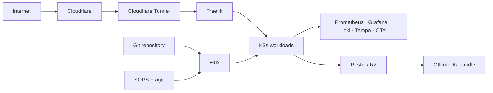

# guiosoft-k3s-lab

A real self-hosted Kubernetes platform built on Debian 13 and K3s, with GitOps, encrypted secrets, full observability, off-host backups and disaster recovery that has been exercised on a separate physical host.

This repository is both the infrastructure source and the engineering record behind the project: architecture decisions, automation, failures found during rehearsals, measured recovery results and the article series derived from that work.

> **Want the visual tour first?** Open the [project showcase](docs/showcase/README.md) for architecture diagrams, validated outcomes and the evidence map.

## Architecture at a glance



## Demonstrated outcomes

| Capability | Validated result |
|---|---|
| GitOps | Flux reconciles cloudflared, Firecrawl and observability |
| Encrypted secrets | SOPS + age runtime recovery tested from encrypted Git state |
| Observability | Metrics, logs and distributed traces validated end to end |
| Full DR | Recovered on a separate Debian 13 physical host |
| Offline recovery | Recovery bundle includes control plane, PV data, OCI images and tooling |
| RTO | **1h07m09s → 47m03s** between measured rehearsals |
| RTO improvement | **29.9%** |
| Consistent backup | **64-second** bounded-consistency recovery-set window |

The numbers above are measured project results, not availability targets or theoretical estimates. Detailed evidence and context are linked from the [showcase](docs/showcase/README.md).

## Current platform

- Debian 13 single-node K3s production cluster.
- Traefik ingress behind Cloudflare Tunnel.
- Flux GitOps with SOPS + age secret decryption.
- Firecrawl running LAN-only in K3s.
- Observability with Prometheus, Alertmanager, Grafana, Loki, Tempo, Alloy and OpenTelemetry Collector.
- K3s SQLite control-plane backups and off-host Restic backups in Cloudflare R2.
- Persistent local-path volume backup and disaster-recovery tooling.
- Verified bounded-consistency recovery sets pairing control-plane and persistent-volume Restic snapshots while persistent writers are quiesced.
- Verified portable offline DR bundle v2 bound to one exact bounded-consistency recovery set, including control-plane, PV, OCI and recovery tooling material.

## Explore

- [Visual project showcase](docs/showcase/README.md)
- [Architecture](docs/architecture.md)
- [Current state](docs/current-state.md)
- [Observability](docs/observability.md)
- [GitOps](docs/gitops.md)
- [Backup](docs/backup.md)
- [Disaster recovery](docs/disaster-recovery.md)
- [Article series — PT / EN / ES](docs/articles/README.md)

## Disaster recovery

Two recovery levels are maintained:

1. **Control-plane DR** — SQLite datastore + K3s server token reconstruct Kubernetes state.
2. **Full DR** — control-plane + local-path persistent volumes + offline OCI images reconstruct runnable workloads.

A full recovery rehearsal was successfully performed in September 2026 on a separate Debian 13 host while production remained operational. The recovered cluster was WAN-isolated, its local PVs were remapped to the replacement node, and Grafana, Tempo, Loki and Prometheus successfully consumed their restored persistent data.

The first independently verified bounded-consistency production recovery set was created on 2026-09-16. Persistent writers were quiesced for the backup window; the exact control-plane and PV Restic snapshots were recorded and independently verified in R2. The measured consistency window was **64 seconds**.

That recovery set was subsequently materialized into the first verified portable offline DR bundle v2. Bundle `backup_set_id=20260916T114220Z` is cryptographically/checksum-bound to control-plane Restic snapshot `6709a96774a79ded9e3435591074d9445d9f814127b0b1a4ba3041d6a39f3882` and PV Restic snapshot `1830fedfe1c6f293cef2eb971f390f28fd761ba1e929c75b9e06c2a007da190e`, preserving the same **64-second** consistency window. The bundle verifier passed before publication.

Key safety/tooling components:

- `scripts/dr-target-init.sh` — mark a machine as an isolated DR target.
- `scripts/dr-network-isolation.sh` — independent nftables WAN barrier.
- `scripts/dr-preflight.sh` — consolidated safety/readiness checks.
- `scripts/dr-restore-k3s.sh` — guarded SQLite/token restore with bootstrap-state handling.
- `scripts/k3s-consistent-backup.sh` — orchestrate a bounded-consistency control-plane + PV recovery set with fail-closed writer restoration.
- `scripts/k3s-consistent-backup-verify.sh` — independently verify a completed recovery set against its exact R2 snapshots.
- `scripts/k3s-pv-backup-r2.sh` — consistent persistent-volume backup after writers are stopped.
- `scripts/k3s-pv-export-r2.sh` — portable snapshot staging from R2.
- `scripts/dr-recovery-set-export.sh` — export the exact identity of a successful bounded-consistency recovery set.
- `scripts/dr-recovery-set-materialize.sh` — materialize the exact CP/PV Restic snapshots identified by a recovery set.
- `scripts/dr-recovery-set-materialize-verify.sh` — independently verify materialized recovery-set identity and artifacts.
- `scripts/dr-recovery-bundle-build.sh` — build and verify a complete portable offline DR bundle from one exact recovery set.
- `scripts/dr-pv-import.sh` — guarded local PV archive import.
- `scripts/dr-pv-remap.sh` — transactional PV/PVC recreation for a replacement node.
- `scripts/dr-oci-kit-build.sh` — build an offline, checksummed OCI recovery kit.
- `scripts/dr-oci-preload.sh` — install OCI archives through the K3s native air-gap preload path.
- `scripts/dr-rehearsal-status.sh` — preflight/status plus RTO/RPO timing report.

See [`docs/disaster-recovery.md`](docs/disaster-recovery.md) for the recovery model, safety rules, tested procedure, and findings from the full rehearsal.

## Recovery metrics

For future rehearsals, start timing immediately before beginning the recovery procedure:

```bash
sudo scripts/dr-rehearsal-status.sh start
```

After the agreed service-recovery criterion is reached, record the recovered backup timestamp and finish:

```bash
sudo env DR_RECOVERED_BACKUP_TIME='2026-09-15T20:45:39-03:00' \
  scripts/dr-rehearsal-status.sh finish
```

The report records measured RTO and, when a backup timestamp is supplied, effective RPO. RTO is measured rather than estimated; RPO is derived from the age of the recovered recovery point at rehearsal start.

## Safety

Never commit plaintext Cloudflare tokens, R2 credentials, Restic passwords, age private identities, SSH credentials, or other runtime secrets. The private age identity and encrypted Restic/R2 recovery material must also exist in an independent off-host DR kit.
