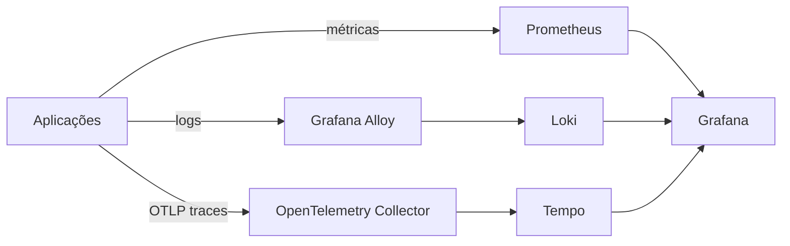
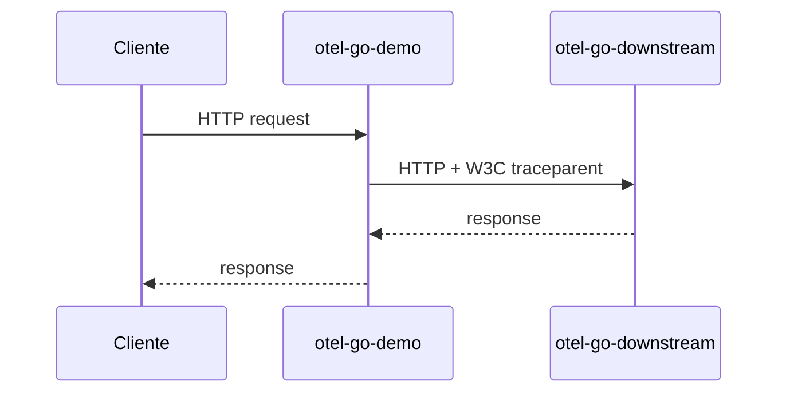
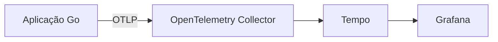
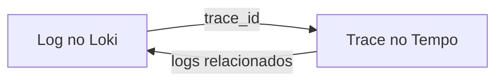
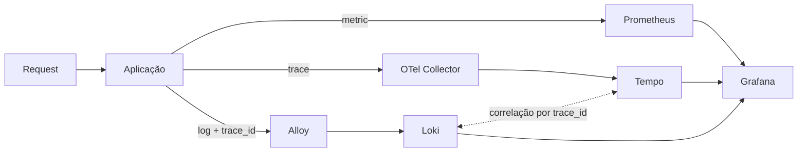

# Observabilidade de verdade em um Kubernetes pequeno

No primeiro estágio do meu homelab Kubernetes, chegar a um conjunto de Pods em `Running` parecia uma vitória suficiente.

Não demorou muito para a pergunta mudar.

**Running significa saudável?**

E, quando alguma coisa ficar lenta, como vou descobrir se o problema está na aplicação, no cluster, no storage ou em uma chamada downstream?

Foi aí que o projeto deixou de ter apenas monitoramento básico e passou a buscar três sinais de observabilidade: métricas, logs e traces.

## A arquitetura

A stack que montei ficou conceitualmente assim:



Usei `kube-prometheus-stack` para Prometheus, Alertmanager, Grafana, Operator, kube-state-metrics e node-exporter. Tempo recebeu os traces. Loki armazenou logs. Alloy fez a coleta dos logs dos Pods. O OpenTelemetry Collector ficou no caminho de ingestão dos traces.

Tudo isso em um único servidor.

Esse último detalhe importa: observabilidade também consome os recursos que está tentando observar.

## Não queria apenas componentes instalados

Um dos critérios do projeto é evitar considerar uma etapa concluída apenas porque o Helm retornou sucesso.

Então criei um pequeno workload em Go instrumentado com OpenTelemetry e métricas Prometheus. Depois ele evoluiu para dois serviços:



O objetivo não era construir uma aplicação interessante. Era produzir um sinal observável que eu pudesse seguir por toda a infraestrutura.

Para tracing, o caminho validado ficou:



O teste gera uma requisição, captura o `trace_id` e procura esse mesmo trace no Tempo. Depois o demo passou a propagar o contexto para o segundo processo, permitindo confirmar os dois `service.name` dentro do mesmo trace distribuído.

Isso é bem diferente de simplesmente verificar se a porta OTLP está aberta.

## Logs e traces precisam conversar

O próximo passo foi fazer os logs carregarem o mesmo `trace_id`.

O Alloy coleta os logs dos Pods pela API do Kubernetes e os envia ao Loki. O demo registra uma linha semelhante a:

```text
request completed service=otel-go-demo method=GET path=/work trace_id=<id>
```

O teste automatizado então:

1. gera uma requisição;
2. captura o `trace_id`;
3. consulta o Loki via LogQL;
4. só termina com sucesso quando encontra uma linha contendo exatamente aquele ID.

Depois configurei os datasources do Grafana para permitir navegação nos dois sentidos:



Foi nesse momento que métricas, logs e traces começaram a parecer uma única ferramenta de investigação, em vez de três produtos instalados lado a lado.

## Uma descoberta pequena sobre métricas Prometheus

Durante os testes apareceu um erro aparentemente simples:

```text
error: custom HTTP metric is not exposed by /metrics
```

A aplicação possuía o endpoint e o collector estava registrado.

O problema era a expectativa do teste.

Métricas vetoriais como `CounterVec` e `HistogramVec` não precisam materializar uma série concreta antes que exista uma combinação de labels observada. Eu estava procurando a família customizada antes de gerar o primeiro request.

O teste foi alterado para primeiro confirmar que `/metrics` era um endpoint Prometheus válido, depois gerar tráfego e somente então exigir as séries `otel_demo_*`.

É uma correção pequena, mas representa exatamente o tipo de aprendizado que eu queria obter com o laboratório: não apenas instalar a ferramenta, mas entender seu comportamento.

## Cardinalidade também faz parte do design

As métricas do demo usam labels deliberadamente limitadas: `service`, `method`, `path` e `status`.

Não coloquei request IDs, trace IDs ou URLs arbitrárias como labels.

Esses dados são excelentes para logs e traces, mas podem transformar a cardinalidade do Prometheus em um problema rapidamente.

O laboratório pequeno é um bom lugar para aprender uma regra que continua válida em ambientes grandes: **nem toda informação útil é uma boa label de métrica.**

## Dashboard e alertas como código

O dashboard da aplicação também é declarativo.

Ele acompanha taxa de requests, p95 de latência, status HTTP, requests em andamento, chamadas downstream, latência downstream e erros.

Também criei regras de alerta para experimentar o fluxo completo, incluindo taxa de 5xx, p95 elevado e erros downstream persistentes.

Os thresholds não são tratados como SLOs universais. São valores didáticos para validar o mecanismo e depois serem ajustados conforme o comportamento real do workload.

## Observabilidade tem custo

Com Prometheus, Alertmanager, Grafana, Loki, Alloy, Tempo e OpenTelemetry Collector ativos, uma medição do node registrou aproximadamente:

```text
CPU:    782m / 13%
Memory: 8331 MiB / 52%
```

Essa medição não é benchmark. É um baseline pontual.

Mesmo assim, ela tornou explícito algo importante: em um single-node, retenção, cardinalidade, caches e número de componentes não são decisões abstratas.

Por isso o perfil inicial é deliberadamente modesto: Prometheus com retenção de sete dias, Tempo com 72 horas, Loki monolítico com filesystem e sete dias de retenção.

## E por que Alloy em vez de Promtail?

Durante a implementação, Promtail já havia chegado ao fim de vida em março de 2026. Em vez de construir uma nova dependência em uma ferramenta encerrada, adotei Grafana Alloy para coleta de logs.

No meu cluster pequeno, o Alloy coleta Pod logs pela API Kubernetes, evitando a necessidade de mounts privilegiados de `/var/log`.

Esse tipo de decisão é outro benefício de construir o ambiente aos poucos: a arquitetura pode acompanhar o estado atual do ecossistema em vez de simplesmente reproduzir um tutorial antigo.

## O resultado que realmente importava

No final, a validação deixou de ser “Grafana abriu?” e passou a verificar o caminho completo:



E os testes automatizados confirmam targets Prometheus, saúde dos componentes, PVCs, métricas customizadas, traces distribuídos e correlação de logs.

Quando isso ficou funcionando, apareceu um novo problema: grande parte dessa infraestrutura ainda havia sido criada operacionalmente. Eu conseguia observá-la, mas queria também conseguir reconstruí-la.

Foi aí que o projeto entrou em GitOps, SOPS e separação mais rigorosa entre configuração declarativa e secrets.

Esse será o próximo artigo.

---

Projeto: `guionardo/guiosoft-k3s-lab`.
