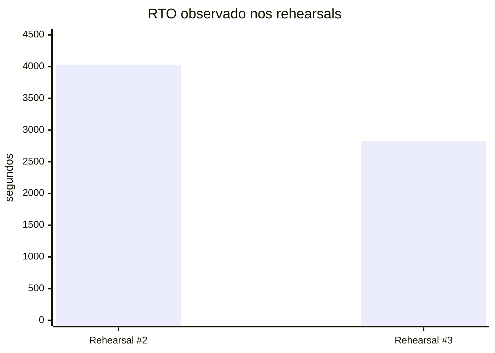

# Medindo Disaster Recovery: reduzindo o RTO em 29,9%

Depois de conseguir restaurar meu cluster K3s em uma segunda máquina, eu poderia ter encerrado a etapa com uma frase confortável:

> Disaster Recovery testado com sucesso.

Mas essa frase esconde uma pergunta importante:

**quanto tempo eu realmente levo para recuperar o ambiente?**

Foi quando passei a tratar os rehearsals não apenas como testes funcionais, mas como experimentos mensuráveis.

## O cronômetro precisa começar antes da parte confortável

É tentador medir apenas o trecho automatizado do restore. Eu preferi uma definição mais dura.

O T0 é registrado antes do bootstrap do K3s no alvo de DR. O RTO observado inclui bootstrap, execução dos scripts, espera, intervenção do operador e tempo gasto investigando problemas encontrados durante o processo.

Isso piora o número. E melhora a informação.

Se durante um incidente real eu precisar descobrir por que um PV não liga ou por que um workload não foi neutralizado, esse tempo faz parte da recuperação.


## Rehearsal #2

No segundo rehearsal completo, os tempos foram:

```text
T0: 2026-09-16T02:11:56Z
T1: 2026-09-16T03:19:05Z

RTO observado: 4029 segundos
              1h 07m 09s
```

No T1, os quatro workloads persistentes estavam Ready, os PV/PVCs estavam Bound ao host `guionote-hp`, os paths locais apontavam para o storage DR, Flux permanecia suspenso, `cloudflared` continuava em zero réplicas e a barreira WAN de nftables permanecia ativa.

Ou seja: T1 não significava apenas “K3s iniciou”. Significava um estado recuperado que eu havia definido como operacionalmente verificável.

## Automatizar o que o rehearsal ensinou

O segundo rehearsal expôs vários passos manuais e pontos frágeis.

Em vez de apenas atualizar o runbook, comecei a transformar essas descobertas em código:

- preflight por estágio;
- neutralização idempotente;
- assertions sobre o estado restaurado;
- remapeamento seguro de PVs;
- preload OCI;
- ativação controlada dos workloads;
- checkpoints da recuperação;
- relatório automático do rehearsal;
- kit offline autocontido.

Uma regra começou a se repetir: **um comando que retorna sucesso não prova que a pós-condição foi atingida**.

Por exemplo, a neutralização passou a consultar novamente a API e verificar que Flux realmente estava suspenso e que Deployments/StatefulSets relevantes estavam com zero réplicas antes de anunciar sucesso.

## Rehearsal #3

O terceiro rehearsal usou o bundle offline e repetiu a medição incluindo problemas descobertos durante a própria execução.

| Medição | Rehearsal #2 | Rehearsal #3 | Diferença |
| --- | ---: | ---: | ---: |
| RTO | 4029 s | 2823 s | -1206 s |
| Tempo | 1h07m09s | 47m03s | -20m06s |
| Melhoria | — | **29,9%** | — |



Eu não removi do cronômetro o tempo gasto corrigindo problemas porque isso produziria um número bonito e pouco útil.

Mesmo assim, o RTO caiu cerca de 20 minutos.

## O que estava saudável no final?

No final do terceiro rehearsal:

```text
guionote-hp   Ready
Tempo         Ready
Loki          Ready
Prometheus    Ready
Grafana       Ready
```

Os quatro pares PV/PVC estavam Bound com paths locais do DR e affinity para `guionote-hp`. As nove imagens OCI do kit estavam instaladas pelo mecanismo nativo de preload do K3s. Flux estava suspenso, `cloudflared` em zero réplicas e o isolamento WAN permanecia ativo.

O servidor de produção continuou operacional durante todo o exercício.

## Os bugs encontrados são parte do resultado

O rehearsal #3 ainda encontrou problemas. E isso é uma coisa boa.

Três deles viraram invariantes explícitos:

**1. Neutralização precisa verificar pós-condições.** Executar `kubectl scale` sem erro não basta. O script agora consulta o estado resultante antes de declarar sucesso.

**2. PV remap precisa aceitar o node DR futuro.** Durante o restore agentless, o Node do DR ainda não existe. A affinity pode e deve ser preparada para o hostname que será registrado depois.

**3. Reset precisa remover checkpoints antigos.** Arquivos `.done` sobreviventes de um rehearsal anterior podem fazer um orquestrador acreditar que uma etapa já foi executada. O reset passou a remover estado corrente e verificar que dados/config do K3s realmente desapareceram.

Mais recentemente, esse reset também ganhou guards adicionais para paths destrutivos e um modo `PREFLIGHT_ONLY`. Os testes deliberadamente tentaram usar `/` como state root e um path fora do namespace permitido; ambos falharam antes de parar qualquer serviço. O preflight válido, por outro lado, passou mantendo K3s ativo, WAN isolada e o disco de dados protegido montado.

## RPO também não é um único número

O exercício trouxe outra correção conceitual.

Eu tinha backup do control plane e backup dos volumes persistentes executados em momentos diferentes.

Portanto, dizer “o RPO é X” escondia a diferença entre os dois artefatos.

Passei a registrar o timestamp real de cada snapshot separadamente.

Isso posteriormente levou a uma melhoria maior: criar um par formal de control plane + PV capturado enquanto os writers persistentes permanecem quiesced.

## Por que medir?

Sem medição, eu provavelmente teria escrito algo como “restore automatizado e documentado”.

Com medição, consigo dizer:

```text
RTO observado #2 = 1h07m09s
RTO observado #3 = 47m03s
melhoria = ~29,9%
```

Mais importante: consigo explicar **por que** melhorou.

Não foi uma otimização de benchmark. Foi a transformação de descobertas operacionais em automação determinística.

Essa é uma diferença que pretendo manter nos próximos rehearsals: não quero apenas reduzir o tempo; quero reduzir incerteza.

E a maior incerteza que ainda existia depois desses testes era a consistência entre o backup do control plane e o backup dos volumes.

Foi daí que nasceu o próximo estágio: um recovery set com identidade própria e uma janela de consistência mensurada em 64 segundos.

Esse será o próximo artigo.

---

Projeto: `guionardo/guiosoft-k3s-lab`.
