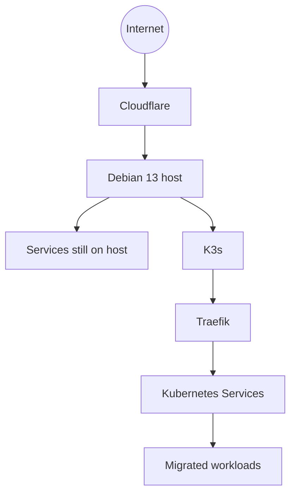
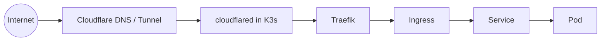
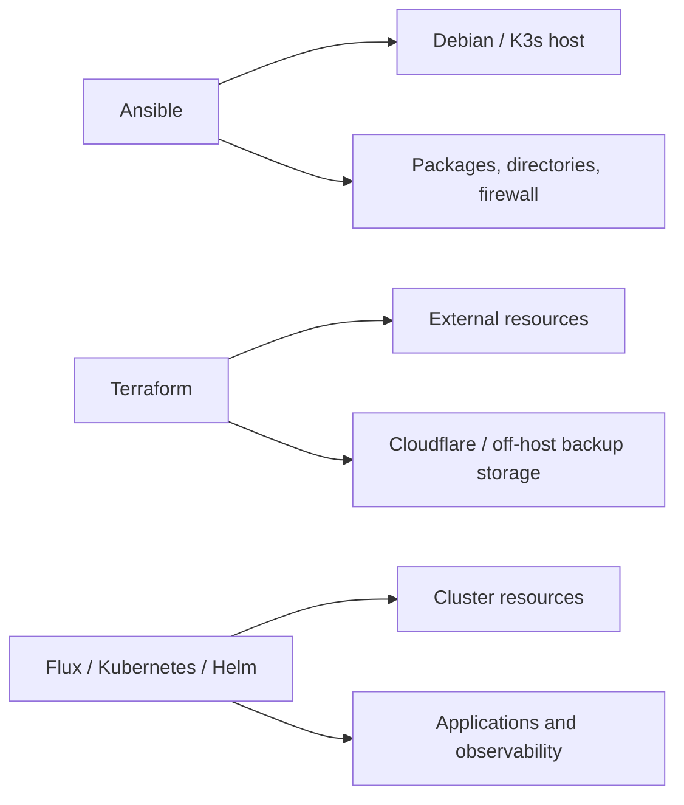

# From a Debian server to a Kubernetes platform at home

A few days ago I started a project that seemed relatively simple: turn a Debian server I have at home into a small Kubernetes environment.

The original idea was to install K3s and use it as a laboratory for containers, observability, GitOps, automation, and distributed applications. But I added one rule: **the cluster would not be just a disposable lab. I would run real applications on it.**

That changed the decisions considerably. Once there are applications I want to keep running, installing Kubernetes stops being the most interesting part of the problem.

Where does the data live? How do I administer the cluster from another machine? How do I publish an application without opening inbound ports? Where do secrets live? What happens after a reboot? How do I reproduce the server configuration? And eventually: if this server dies today, can I rebuild everything?

What started as a K3s installation became a platform-engineering exercise.

## Why K3s?

The environment is deliberately small: one physical server running Debian 13. I wanted to reduce initial operational cost without giving up Kubernetes primitives such as Deployments, StatefulSets, Services, Ingress, PVCs, scheduling, observability, and GitOps.

So I started with single-node K3s. Two replicas on the same server can protect against a process or Pod failure, but not against physical host failure. This is not host-level high availability; that limitation is intentional and part of the lab.

## The server already existed

The Debian host already ran services directly, so Kubernetes adoption could not become a big-bang migration.

Each application could move independently, with its public route changed only after the K3s workload was validated. That gives migrations a property I value: **small rollback scope**.

## Networking

The host also ran Docker, so I explicitly chose K3s networks:

| Network | CIDR |
|---|---|
| Pods | `10.42.0.0/16` |
| Services | `10.43.0.0/16` |

The intent was to keep them away from existing Docker bridges in the `172.x` ranges. I also configured kubeconfig for administration from another LAN machine; the cluster needed to be administered as infrastructure, not only through the server's local shell.

## Why keep Traefik with Cloudflare Tunnel?

Because the tunnel is established outbound, I do not need to open a router port for every application. The target path became:

I deliberately kept Traefik in the path because I want Ingress, middleware, and routing to remain Kubernetes responsibilities. Cloudflare is the external entry point; it should not become a catalog of every application's internal topology.

Later, `cloudflared` itself moved from a host service into K3s with two replicas. The old host installation was preserved but disabled as a rollback path.

## Storage: reconstructable configuration is not persistent data

I started with K3s's `local-path` provisioner. For a single-node cluster it is simple and sufficient for learning PVCs and persistent workloads. But one distinction became increasingly important: **manifests can be reconstructed; data cannot necessarily be reconstructed.**

K3s storage was organized so local volumes live in a known disk area, separating configuration, persistent data, and backups. That later became essential during real Disaster Recovery testing.

## Infrastructure as Code, with separate responsibilities

The physical host has a different lifecycle from a Kubernetes Deployment, and both differ from an external resource. I later pushed this separation further in Ansible: common, production, and DR variables belong to different groups. By default, DR does not inherit production off-host backup automation or `cloudflared`.

## Firewall and reducing host surface

The host received a dedicated nftables policy, persisted through systemd and validated after reboot. Installed but unnecessary listeners such as NFS/RPC, PCP, and Cockpit were disabled reversibly. The objective was to reduce the actual surface found on that server without destroying rollback options.

## The first result

The server was still a physical machine at home, but it had become a platform with single-node K3s, Traefik, Cloudflare Tunnel inside the cluster, real workloads, known persistent storage, persistent firewall policy, Ansible-managed host configuration, Terraform-managed external resources, and remote LAN administration.

And exactly when everything started working, the next question appeared: **How do I know all of this is working well?**

`kubectl get pods` is an excellent tool, but it is not an observability strategy. In the next article I show how this small cluster gained metrics, logs, and traces—and why installing Grafana was only a small part of the problem.

---

Project: `guionardo/guiosoft-k3s-lab`.
