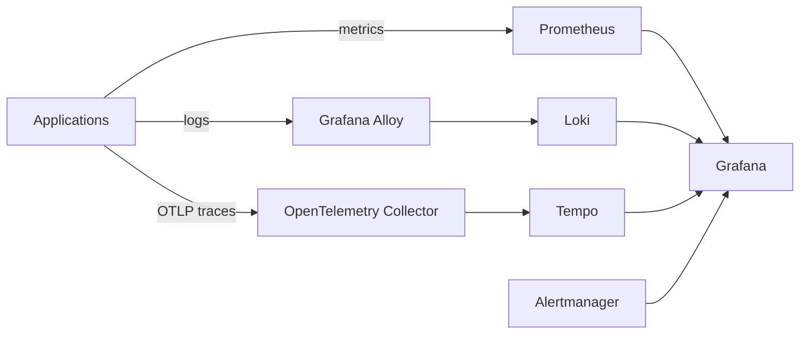
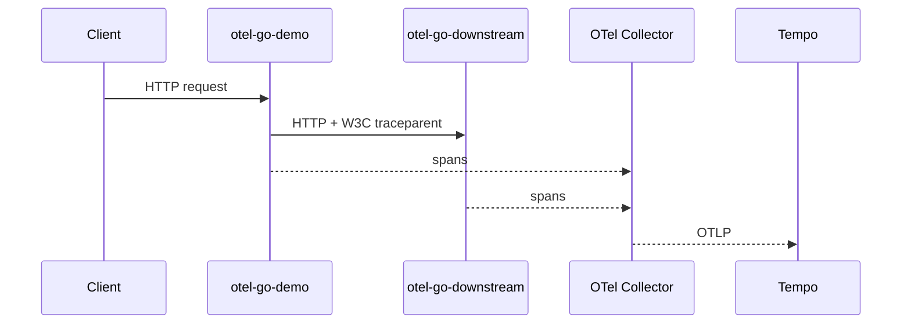
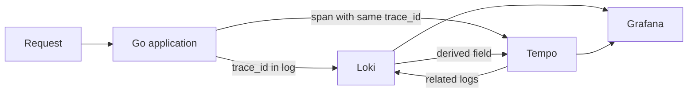
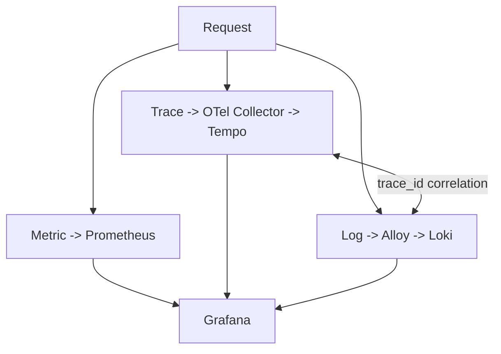

# Real observability in a small Kubernetes cluster

During the first stage of my Kubernetes homelab, getting Pods into `Running` felt like enough of a victory. It did not take long for the question to change: **does Running mean healthy?**

When something becomes slow, how do I discover whether the problem is in the application, cluster, storage, or a downstream call? That is when the project moved toward three observability signals: metrics, logs, and traces.

## The architecture

I used `kube-prometheus-stack` for Prometheus, Alertmanager, Grafana, the Operator, kube-state-metrics, and node-exporter. Everything runs on one server, which matters: observability also consumes the resources it observes.

## I did not want merely installed components

I created a small Go workload instrumented with OpenTelemetry and Prometheus metrics. It later evolved into two services so I could validate context propagation:

The test generates a request, captures its `trace_id`, and looks up that exact trace in Tempo, confirming both `service.name` values in the same distributed trace. That is very different from checking whether an OTLP port is open.

## Logs and traces need to talk to each other

The same `trace_id` is written to application logs. Alloy collects Pod logs through the Kubernetes API and sends them to Loki. The automated test generates a request, captures the trace ID, queries Loki through LogQL, and succeeds only when it finds that exact ID.

At that point metrics, logs, and traces started to feel like one investigation system instead of three products installed next to each other.

## A small Prometheus metrics discovery

One test initially failed with `custom HTTP metric is not exposed by /metrics`. The endpoint existed and the collector was registered; the test's expectation was wrong. Vector metrics such as `CounterVec` and `HistogramVec` do not need to materialize a concrete series before a label combination has been observed.

The test was changed to verify `/metrics`, generate traffic, and only then require the `otel_demo_*` series. It was a small fix, but exactly the kind of learning I wanted: understand behavior, not merely install software.

## Cardinality is also part of design

The demo deliberately limits labels to `service`, `method`, `path`, and `status`. Request IDs, trace IDs, and arbitrary URLs are not metric labels. Those values are excellent in logs and traces but can quickly turn Prometheus cardinality into a problem.

## Dashboards, alerts, and cost

The declarative dashboard tracks request rate, p95 latency, HTTP status, in-flight requests, downstream calls, downstream latency, and errors. Alert rules cover 5xx rate, elevated p95, and persistent downstream errors; their thresholds are didactic rather than universal SLOs.

One node measurement with the stack active showed approximately:

| Resource | Usage |
|---|---:|
| CPU | `782m / 13%` |
| Memory | `8331 MiB / 52%` |

This is a point-in-time baseline, not a benchmark. The initial retention profile is therefore modest: seven days for Prometheus, 72 hours for Tempo, and seven days for filesystem-backed monolithic Loki.

## Why Alloy instead of Promtail?

During implementation, Promtail had reached end of life in March 2026. Rather than introduce a new dependency on a retired tool, I adopted Grafana Alloy. In this small cluster it collects Pod logs through the Kubernetes API, avoiding privileged `/var/log` mounts.

## The result that mattered

Automated tests verify Prometheus targets, component health, PVCs, custom metrics, distributed traces, and log correlation.

Once this worked, a new problem became visible: much of the infrastructure had originally been created operationally. I could observe it, but I also wanted to reconstruct it. That led the project into GitOps, SOPS, and stricter separation between declarative configuration and secrets.

---

Project: `guionardo/guiosoft-k3s-lab`.
