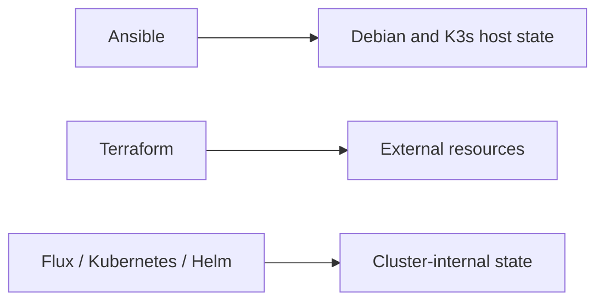
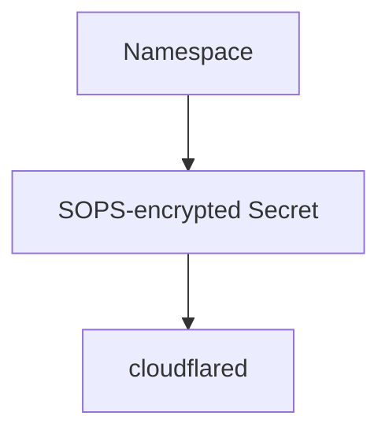
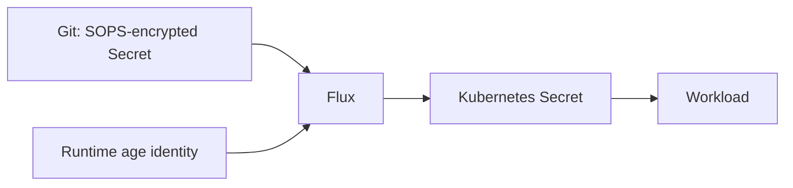
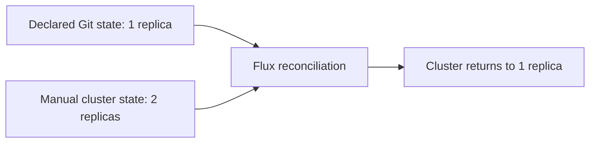
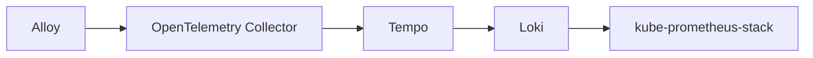
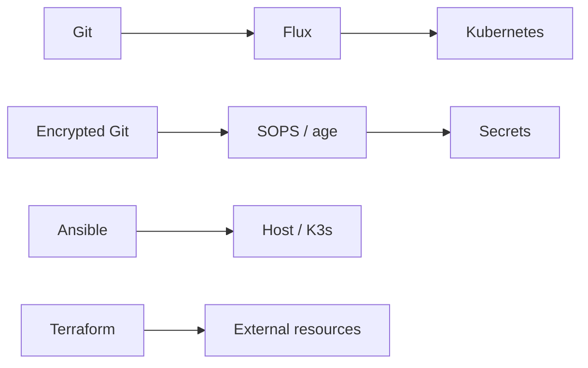

# GitOps, secrets, and reproducible infrastructure

After putting applications and observability into my K3s cluster, one question started bothering me: **How much of this environment exists because it is declared—and how much exists only because I remember the commands I ran?**

The next stage was reducing the number of decisions that existed only in the current machine state.

## Three layers, three responsibilities



Tools can overlap in capability without overlapping in ownership. For me, reproducible infrastructure begins when it is clear **who owns each piece of state**.

## Why Flux?

I chose Flux because the repository already contained Kubernetes manifests and Helm configuration, and I had adopted SOPS + age for secrets. Native SOPS decryption in `kustomize-controller` and the pull-based model fit the lab well.

## Start with the least dangerous workload

The first workload placed under Flux ownership was `cloudflared`: small, stateless, declarative, and easy to roll back.



After validating that chain I tested manual drift, a versioned change, Git rollback, and deliberate Secret deletion followed by reconstruction from encrypted repository state. GitOps without a reconstruction test can be little more than optimistic synchronization.

## Secrets in Git—but not plaintext



The public age recipient may live in the repository; the private identity may not. Metadata remains readable while sensitive values are encrypted. This has an important DR consequence: **Git alone cannot rebuild the cluster.** The private identity needs an independent recovery path.

## Self-healing needs to be observed

After `cloudflared`, I moved Firecrawl under Flux ownership and deliberately introduced positive drift by scaling its API from one replica to two.



The endpoint remained available while Flux restored the declared state.

## Adopting existing resources without recreating them

Prometheus, Grafana, Loki, Tempo, Alloy, and OpenTelemetry Collector already existed before Flux ownership. HelmReleases were declared to match the existing releases, initially suspended, and activated conservatively:



At every stage I validated HelmRelease readiness, runtime releases, Pods, PVCs, and functional metrics/logs/traces paths. GitOps adoption became an ownership migration rather than a blind redeployment.

## GitOps does not replace rollback

If reconciliation causes a problem, the affected Kustomization or HelmRelease can be suspended, Git corrected, and reconciliation resumed. Automation is useful when it also has a clear interruption and rollback path.

## Idempotency as evidence

Re-running the Ansible playbook that installs the age identity after the Secret already existed ended with `changed=0`. More recently, splitting Ansible variables into common, production, and DR groups produced a production dry-run of:

```text
ok=16
changed=0
failed=0
```

The DR inventory defaults consistent backup, R2, and `cloudflared` to `false`. This is not merely YAML organization; it reduces blast radius.

## What can Git reconstruct?



But the reconstruction question was still unanswered. I had declarative configuration, encrypted secrets, and backups. Then came the question that changed the project: **If the server disappears, can I actually restore everything on another machine?**

Having backups and being able to perform Disaster Recovery are different things. I learned that by doing the restore for real.

---

Project: `guionardo/guiosoft-k3s-lab`.
