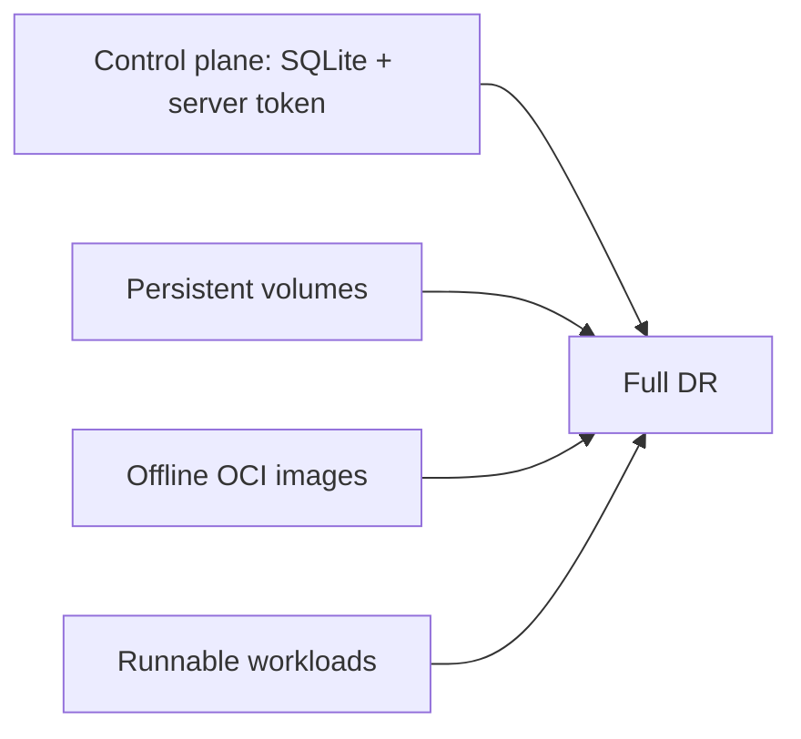
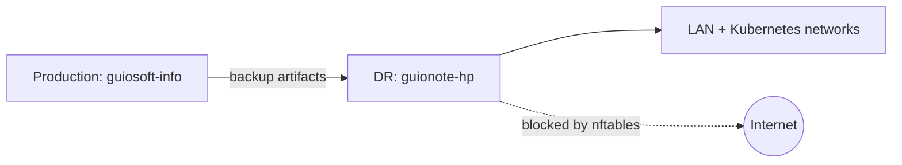
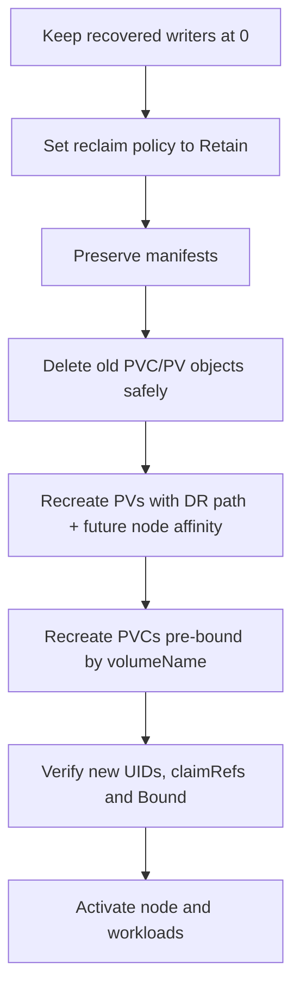
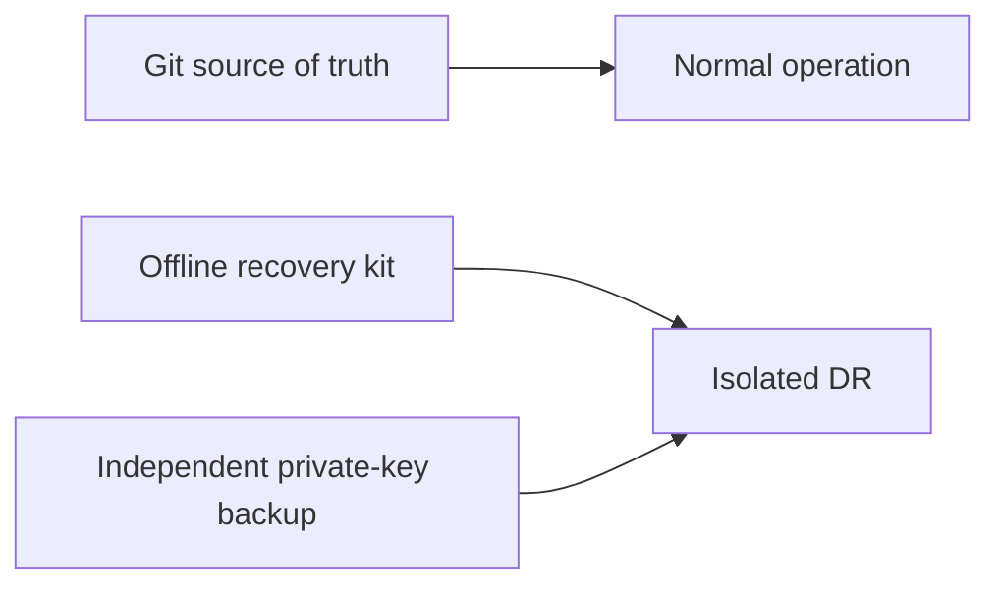

# Backup does not mean Disaster Recovery

I had backups of my Kubernetes cluster. Then I asked the question that is usually easy to postpone: **Can I actually restore them?**

The short answer was: not as easily as it seemed. The exercise stopped being about creating backups and became about producing a runnable system on another machine.

## Two recovery levels



A cluster backup is not one thing.

## A DR target must be dangerous by design—and safe by control

I used a second Debian 13 machine, `guionote-hp`, as the recovery target while production continued on `guiosoft-info`.



The target receives an independent nftables WAN barrier before restore. Destructive scripts require a DR marker, reject the production hostname/IP, and require explicit confirmations. The reset later gained a non-destructive preflight mode; running it against production was deliberately tested and refused before changes.

## First problem: the datastore does not live alone

Restoring only database and token while keeping TLS/credential material from the clean target could create bootstrap incompatibilities. The strategy changed: preserve target material in a safety area, restore the datastore, and allow K3s to reconstruct bootstrap material from recovered state.

## Second problem: local PersistentVolumes remember the old server

Recovered PVs still had node affinity for production and local paths pointing to production storage. Those fields cannot simply be fixed with a normal patch.



Recovered `Terminating` Pods could also keep references to protected PVCs, so only Pods blocking the transaction were removed.

## Third problem: the recovered cluster starts without the DR node

During isolated restore K3s starts agentless (`disable-agent:true`). The API may contain only the restored production Node; the DR Node does not exist yet. PV remapping therefore needs to accept affinity for a **future hostname**.

## Fourth problem: an image being listed does not make it a backup

The production containerd content store was not a reliable image backup. The solution was a platform-specific `linux/amd64` OCI kit with origin-generated checksums, loaded through K3s's native preload directory:

```text
/var/lib/rancher/k3s/agent/images/
```

Validation happens through the CRI. Recovery therefore remains independent of external registries.

## GitHub disappears during the disaster too

If DR blocks Internet access, the runbook cannot depend on `git pull`. The recovery kit carries a self-contained versioned copy of required scripts, checksums, OCI images, and encrypted recovery material. Private credentials remain outside Git and require independent recovery.



## And the workloads?

Grafana, Loki, Prometheus, and Tempo were recovered. In one rehearsal Tempo discarded an incomplete WAL block missing `meta.json`, another warning that a filesystem copy can be recoverable without being application-consistent.

## The main lesson

| Assumption | What the rehearsal showed |
|---|---|
| Datastore backup | Not the same as a runnable cluster |
| PV data | Not automatically usable on another node |
| Image in containerd | Not necessarily a reliable OCI backup |
| Git available today | Does not mean Git is available during DR |
| Script exited 0 | Does not prove its postcondition |

Backup is an artifact. Disaster Recovery is a capability that must be exercised.

Once I could recover the environment, the next question was: **How long does it take?** The next article measures RTO including bootstrap, manual intervention, and problems discovered during rehearsal.

---

Project: `guionardo/guiosoft-k3s-lab`.
