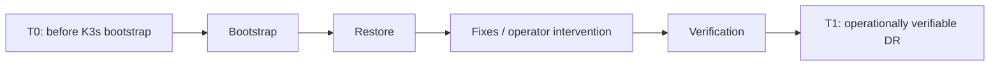
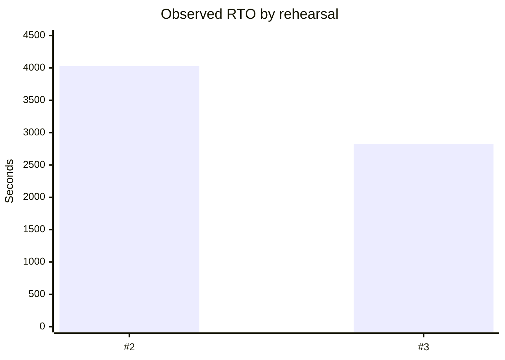
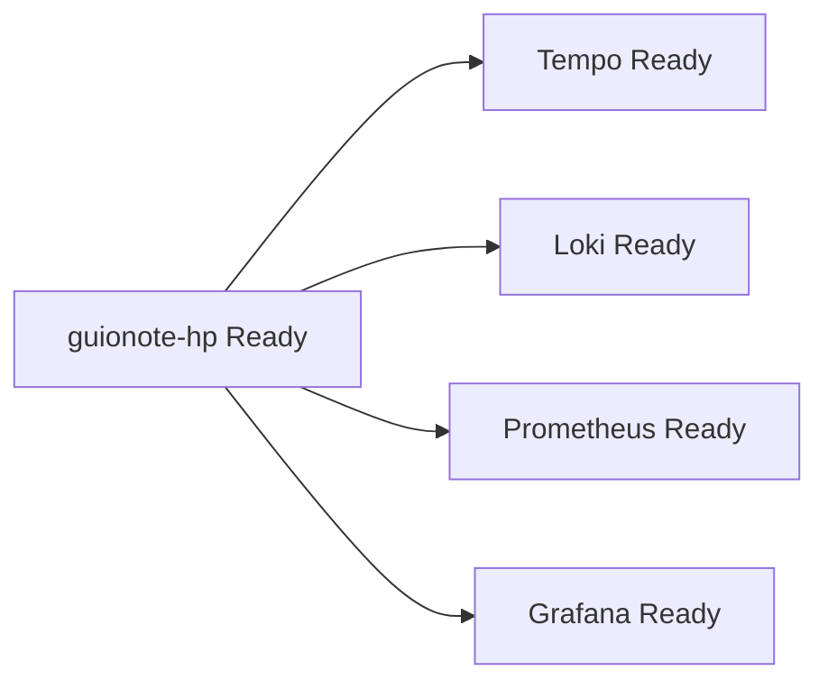

# Measuring Disaster Recovery: reducing RTO by 29.9%

After successfully restoring my K3s cluster on a second machine, I could have ended with “Disaster Recovery successfully tested.” But that hides an important question: **How long does recovery actually take?**

I started treating rehearsals not only as functional tests, but as measurable experiments.

## The clock must start before the comfortable part

T0 is recorded before K3s bootstrap on the DR target. Observed RTO includes bootstrap, scripts, waiting, operator intervention, and time spent investigating problems discovered during the process.



That makes the number worse—and the information better.

## Rehearsal #2

| Measurement | Value |
|---|---|
| T0 | `2026-09-16T02:11:56Z` |
| T1 | `2026-09-16T03:19:05Z` |
| Observed RTO | `4029 s = 1h 07m 09s` |

At T1 all four persistent workloads were Ready, PV/PVC pairs were Bound to `guionote-hp`, Flux remained suspended, `cloudflared` stayed at zero replicas, and the WAN barrier remained active.

## Automate what the rehearsal teaches

The second rehearsal exposed manual steps and fragile assumptions. Those discoveries became stage-aware preflight, idempotent neutralization, restored-state assertions, safe PV remapping, OCI preload, controlled workload activation, recovery checkpoints, automatic reporting, and a self-contained offline kit.

One rule kept repeating: **a command returning success does not prove its postcondition was reached.**

## Rehearsal #3



| Measurement | Rehearsal #2 | Rehearsal #3 |
|---|---:|---:|
| RTO | `1h07m09s` | `47m03s` |
| Seconds | 4029 | 2823 |
| Delta |  | `-1206 s` |
| Improvement |  | `~29.9%` |

I did not remove debugging time from the clock just to produce a prettier number. Even so, observed RTO fell by roughly twenty minutes.

## What was healthy at the end?



All four PV/PVC pairs were Bound with DR-local paths and affinity to `guionote-hp`. Nine OCI images were installed through K3s native preload. Flux was suspended, `cloudflared` was at zero replicas, WAN isolation remained active, and production stayed operational.

## Bugs found are part of the result

Three findings became explicit invariants: neutralization must verify postconditions; PV remapping must accept the future DR node; reset must remove stale checkpoints. The reset was later hardened with destructive-path guards and `PREFLIGHT_ONLY`, with deliberate unsafe-path tests failing before any service was stopped.

## RPO is not one number either

Control-plane and PV backups had been captured at different times. Saying “the RPO is X” hid that difference. I started recording each snapshot's actual timestamp separately, which eventually led to creating a formal control-plane + PV pair while persistent writers remain quiesced.

## Why measure?

Without measurement I might have written “restore automated and documented.” With measurement I can say:

```text
observed RTO #2 = 1h07m09s
observed RTO #3 = 47m03s
improvement = ~29.9%
```

More importantly, I can explain **why** it improved: operational discoveries were converted into deterministic automation.

The largest uncertainty left was consistency between control-plane and PV backups. That led to the next stage: a recovery set with its own identity and a measured 64-second consistency window.

---

Project: `guionardo/guiosoft-k3s-lab`.
