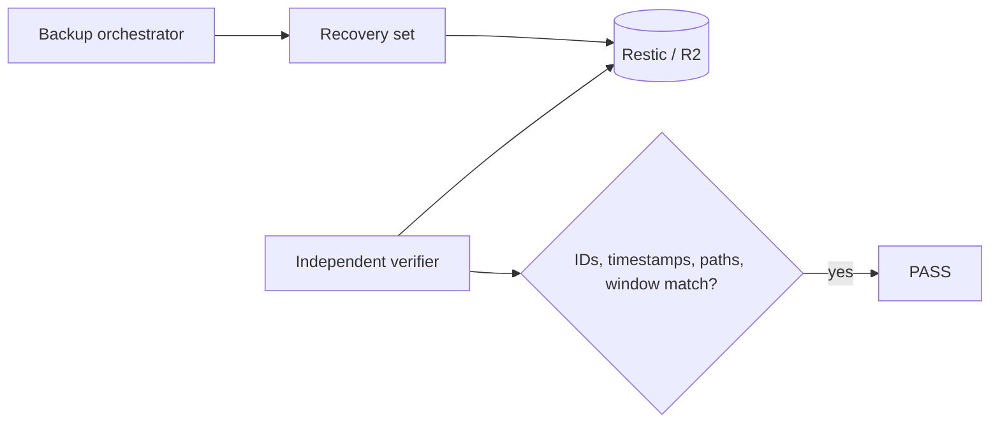
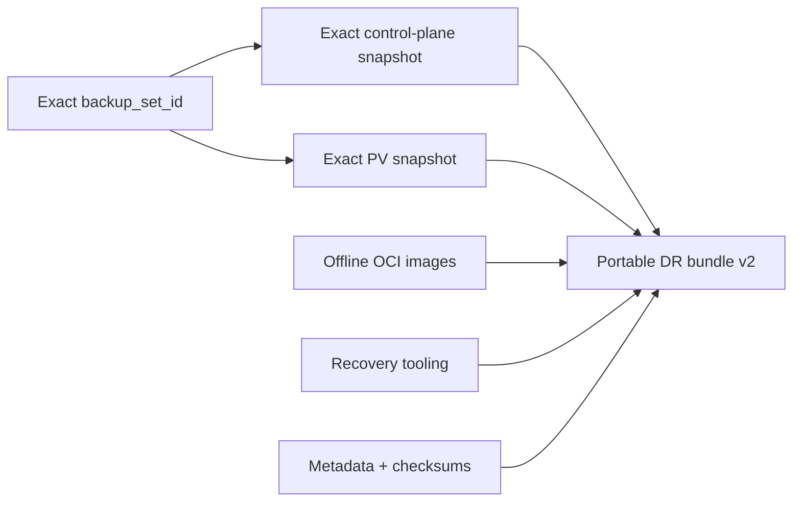

# The problem of consistent backups in Kubernetes

After three Disaster Recovery rehearsals, I could rebuild the control plane, restore PersistentVolumes, load OCI images without Internet access, and start workloads on another machine. But one conceptual problem remained.

I had a control-plane backup and a volume backup. **That did not mean I had a consistent system state.**

## Two correct backups can produce an incorrect restore

```mermaid
timeline
    title Two valid backups, different moments
    10:00 : Control-plane backup
    10:10 : Application keeps writing
    10:20 : Persistent-volume backup
```

Both backups may be technically valid yet represent different moments. In my lab this became tangible when Tempo had to deal with an incomplete WAL block during an earlier restore.

## The idea: a bounded-consistency recovery set


I am not claiming distributed atomicity. I am claiming that I know and can measure the interval during which writers remained quiesced while both sides of the backup were captured.

## Quiescing without fighting operators

Grafana, Tempo, and Loki are StatefulSets that can be scaled down in a controlled way. Prometheus is managed by the Prometheus Operator, so I temporarily change `spec.replicas` on the Prometheus resource rather than fighting the generated StatefulSet.

The process is fail-closed: I do not force-delete production writer Pods to obtain a backup. If graceful quiesce does not complete within the limit, the consistent backup fails.

## Fail before interrupting writers

The orchestrator validates the K3s API, required tools, and Restic/R2 repository before quiescing anything. Expensive retention, prune, and integrity operations happen after writers are restored. The critical window contains only work that actually requires consistency.

## Exact artifact identity

The recovery set abandons “restore the latest backup” and records exact IDs and timestamps.

```mermaid
timeline
    title First successful consistent recovery set
    11:42:34Z : Writers quiesced
    11:42:39Z : Control-plane snapshot
    11:43:00Z : PV snapshot
    11:43:38Z : Backup window complete
    11:44:21Z : Writers restored
```

| Field | Value |
|---|---|
| `backup_set_id` | `20260916T114220Z` |
| Control-plane snapshot | `6709a967...f3882` |
| PV snapshot | `1830fedf...190e` |
| Consistency window | **64 seconds** |
| Result | `PASS` |

## Verify the verifier

The orchestrator reporting `PASS` was still not enough. An independent verifier reopens the off-host repository and checks metadata, both exact snapshot IDs, actual timestamps, the recorded control-plane archive, expected PV root, and whether timestamps fall inside the recorded window.



## Backup concurrency is state too

Daily and weekly workflows share `/run/lock/guiosoft-k3s-backup.lock`. The weekly wrapper keeps the lock through capture, verification, and later Restic maintenance so another process cannot change the repository context halfway through verification.

## From recovery set to portable bundle



The first portable v2 bundle was built from the 64-second recovery set and passed full verification.

## What changed in my definition of backup

At the beginning, backup meant roughly “file exists outside the server.” After the rehearsals, it means artifact and checksum exist, exact snapshot and timestamp are known, CP/PV relationship is known, restore has been exercised, images and tooling are available offline, secrets have independent recovery, and postconditions are verified.

That is more work, but it turns backup from hope into a testable system property.

## Where the project stands now

The homelab now combines Ansible-declared host infrastructure, Terraform-managed external resources, Flux-reconciled workloads, SOPS + age encrypted secrets, correlated metrics/logs/traces, Restic/R2 off-host backup, full DR rehearsals, offline OCI recovery, measured RTO, bounded recovery sets, a portable DR bundle tied to exact snapshots, fail-closed destructive-operation guards, and declarative production/DR separation.

The most interesting part of the lab is no longer Kubernetes itself. It is using a small environment to exercise questions that also appear in much larger systems: **Is the state declared? Is it observable? Is it recoverable? Can we prove it?**

---

Project: `guionardo/guiosoft-k3s-lab`.
