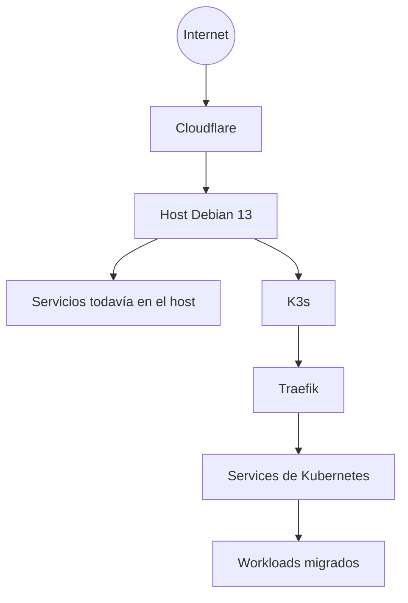
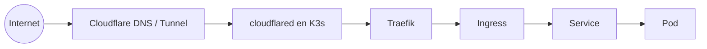
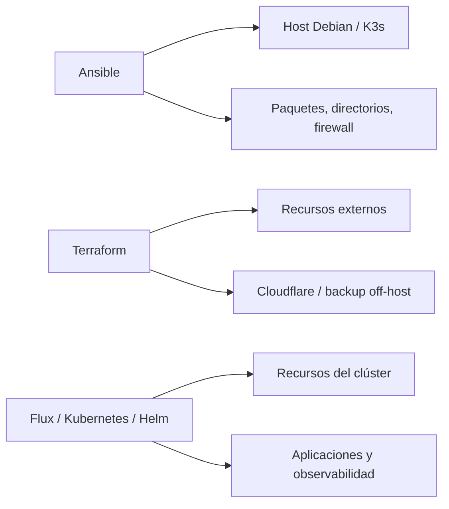

# De un servidor Debian a una plataforma Kubernetes en casa

Hace unos días empecé un proyecto que parecía relativamente sencillo: transformar un servidor Debian que tengo en casa en un pequeño entorno Kubernetes.

La idea inicial era instalar K3s y usarlo como laboratorio para contenedores, observabilidad, GitOps, automatización y aplicaciones distribuidas. Pero añadí una regla: **el clúster no sería solamente un laboratorio descartable. Ejecutaría aplicaciones reales en él.**

Eso cambió bastante las decisiones. Cuando hay aplicaciones que quiero mantener funcionando, instalar Kubernetes deja de ser la parte más interesante del problema.

¿Dónde viven los datos? ¿Cómo administro el clúster desde otra máquina? ¿Cómo publico una aplicación sin abrir puertos de entrada? ¿Dónde viven los secrets? ¿Qué ocurre después de un reinicio? ¿Cómo reproduzco la configuración del servidor? Y, finalmente: si este servidor muere hoy, ¿puedo reconstruirlo todo?

Lo que empezó como una instalación de K3s terminó convirtiéndose en un ejercicio de ingeniería de plataforma.

## ¿Por qué K3s?

El entorno es deliberadamente pequeño: un único servidor físico con Debian 13. Quería reducir el coste operativo inicial sin renunciar a primitivas de Kubernetes como Deployments, StatefulSets, Services, Ingress, PVCs, scheduling, observabilidad y GitOps.

Por eso empecé con K3s single-node. Dos réplicas en el mismo servidor pueden proteger contra el fallo de un proceso o Pod, pero no contra el fallo físico del host. No es alta disponibilidad a nivel de máquina; esa limitación es intencional y forma parte del laboratorio.

## El servidor ya existía

El host Debian ya ejecutaba servicios directamente, así que la adopción de Kubernetes no podía convertirse en una migración big bang.

Cada aplicación podía migrarse de forma independiente y su ruta pública solo cambiaba después de validar el workload en K3s. Esto mantiene pequeño el alcance del rollback.

## Red

El host también ejecutaba Docker, así que definí explícitamente las redes de K3s:

| Red | CIDR |
|---|---|
| Pods | `10.42.0.0/16` |
| Services | `10.43.0.0/16` |

La intención era mantenerlas alejadas de las bridges Docker existentes en rangos `172.x`. También configuré kubeconfig para administrar el clúster desde otra máquina de la LAN.

## ¿Por qué mantener Traefik con Cloudflare Tunnel?

Como el túnel se establece desde dentro hacia fuera, no necesito abrir un puerto del router para cada aplicación.

Decidí mantener Traefik porque quiero que Ingress, middlewares y routing sigan siendo responsabilidades de Kubernetes. Cloudflare es el punto de entrada externo; no debería convertirse en un catálogo de la topología interna de cada aplicación.

Más tarde, `cloudflared` también migró del host a K3s con dos réplicas. La instalación antigua quedó preservada pero deshabilitada como camino de rollback.

## Storage: configuración reconstruible no es dato persistente

Empecé con el provisioner `local-path` de K3s. Para un clúster single-node es simple y suficiente, pero una distinción se volvió cada vez más importante: **los manifests pueden reconstruirse; los datos no necesariamente.**

Organicé el storage para separar configuración, datos persistentes y backups. Esa decisión se volvió fundamental cuando empecé a probar Disaster Recovery de verdad.

## Infrastructure as Code con responsabilidades separadas

El host físico tiene un ciclo de vida diferente de un Deployment, y ambos difieren de un recurso externo. Más tarde separé también las variables Ansible comunes, de producción y de DR; por defecto DR no hereda automatización de backup off-host ni `cloudflared` de producción.

## Firewall y reducción de superficie

El host recibió una política nftables dedicada, persistida mediante systemd y validada después de reiniciar. Listeners innecesarios de NFS/RPC, PCP y Cockpit fueron deshabilitados de forma reversible.

## El primer resultado

El servidor seguía siendo una máquina física en casa, pero ya era una plataforma con K3s single-node, Traefik, Cloudflare Tunnel dentro del clúster, workloads reales, storage persistente conocido, firewall persistente, configuración del host con Ansible, recursos externos con Terraform y administración remota por LAN.

Y justo cuando todo empezó a funcionar apareció la siguiente pregunta: **¿cómo sé que todo esto está funcionando bien?**

`kubectl get pods` es una excelente herramienta, pero no es una estrategia de observabilidad. Ese es el tema del siguiente artículo.

---

Proyecto: `guionardo/guiosoft-k3s-lab`.
