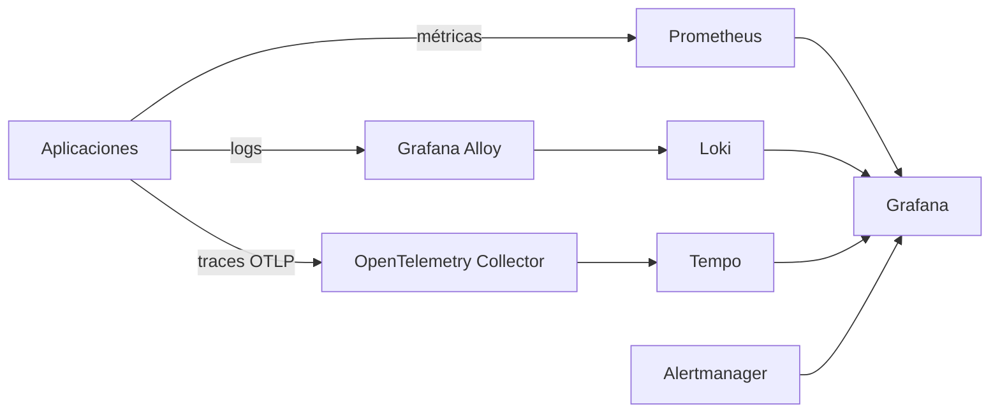
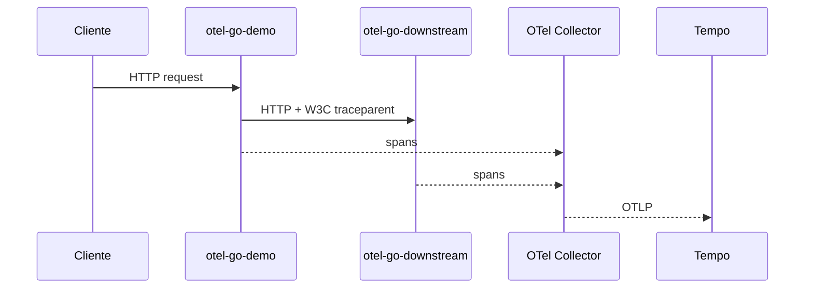
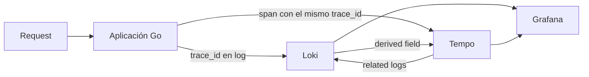
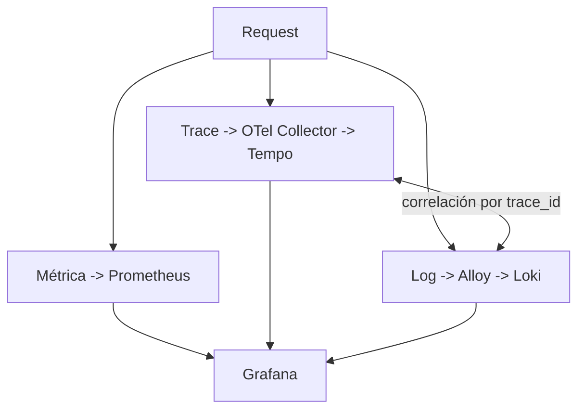

# Observabilidad real en un Kubernetes pequeño

En la primera etapa de mi homelab Kubernetes, conseguir que los Pods estuvieran en `Running` parecía una victoria suficiente. La pregunta cambió rápidamente: **¿Running significa saludable?**

Cuando algo se vuelve lento, ¿cómo descubro si el problema está en la aplicación, el clúster, el storage o una llamada downstream? El proyecto pasó entonces a trabajar con tres señales: métricas, logs y traces.

## La arquitectura

Usé `kube-prometheus-stack` para Prometheus, Alertmanager, Grafana, Operator, kube-state-metrics y node-exporter. Todo funciona en un único servidor, un detalle importante porque la observabilidad también consume los recursos que observa.

## No quería solamente componentes instalados

Creé un pequeño workload en Go instrumentado con OpenTelemetry y métricas Prometheus. Después evolucionó a dos servicios para validar propagación de contexto:

El test genera una petición, captura su `trace_id` y busca exactamente ese trace en Tempo, confirmando ambos `service.name` dentro del mismo trace distribuido. Es muy diferente de comprobar solamente que un puerto OTLP está abierto.

## Logs y traces necesitan conversar

El mismo `trace_id` se escribe en los logs. Alloy recoge los logs de Pods mediante la API Kubernetes y los envía a Loki. El test genera una petición, captura el ID, consulta Loki con LogQL y solo termina correctamente cuando encuentra ese mismo valor.

A partir de ahí métricas, logs y traces empezaron a funcionar como un único sistema de investigación.

## Un pequeño descubrimiento sobre Prometheus

Un test falló inicialmente porque esperaba una métrica custom antes de generar tráfico. Métricas vectoriales como `CounterVec` y `HistogramVec` no necesitan materializar una serie concreta antes de observar una combinación de labels.

El test pasó a validar `/metrics`, generar tráfico y solo entonces exigir las series `otel_demo_*`. Es un detalle pequeño, pero representa el objetivo del laboratorio: entender el comportamiento, no solamente instalar herramientas.

## Cardinalidad también forma parte del diseño

El demo limita deliberadamente las labels a `service`, `method`, `path` y `status`. Request IDs, trace IDs y URLs arbitrarias no son labels de métricas. Son excelentes datos para logs y traces, pero pueden disparar rápidamente la cardinalidad de Prometheus.

## Dashboards, alertas y coste

El dashboard declarativo acompaña tasa de requests, latencia p95, status HTTP, requests en curso, llamadas downstream, latencia downstream y errores. También añadí alertas para 5xx, p95 elevado y errores downstream persistentes.

Una medición puntual del node mostró:

| Recurso | Uso |
|---|---:|
| CPU | `782m / 13%` |
| Memoria | `8331 MiB / 52%` |

No es un benchmark. El perfil inicial de retención es deliberadamente modesto: siete días para Prometheus, 72 horas para Tempo y siete días para Loki monolítico sobre filesystem.

## ¿Por qué Alloy en vez de Promtail?

Durante la implementación, Promtail había llegado al final de su vida en marzo de 2026. Preferí Grafana Alloy, que en este clúster recoge logs mediante la API Kubernetes sin mounts privilegiados de `/var/log`.

## El resultado que importaba

Los tests automatizados verifican targets Prometheus, salud de componentes, PVCs, métricas custom, traces distribuidos y correlación de logs.

Cuando esto funcionó apareció otro problema: podía observar la infraestructura, pero también quería poder reconstruirla. Eso llevó el proyecto hacia GitOps, SOPS y una separación más estricta entre configuración declarativa y secrets.

---

Proyecto: `guionardo/guiosoft-k3s-lab`.
