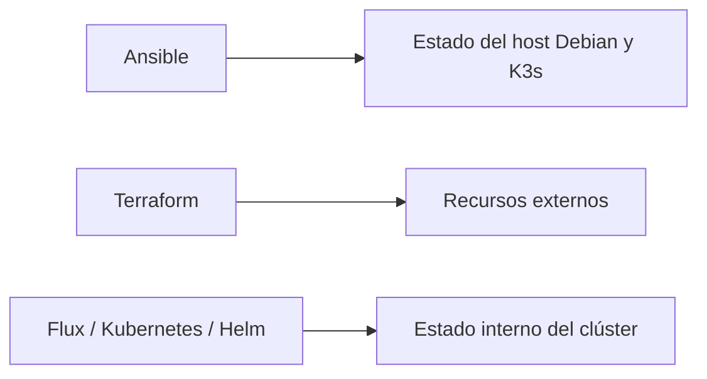
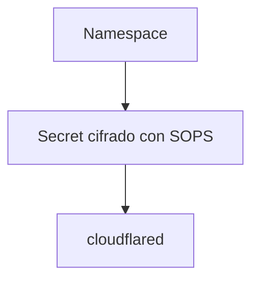
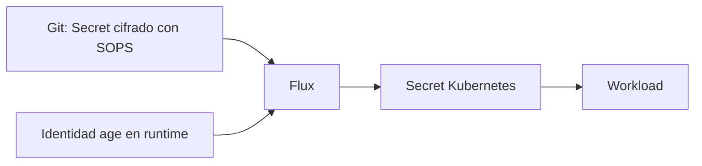
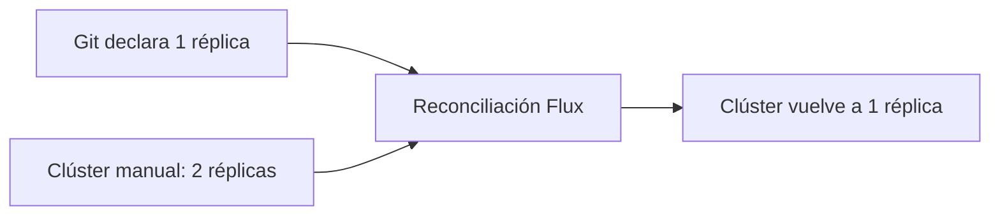
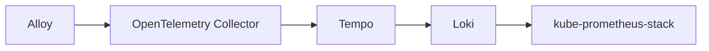
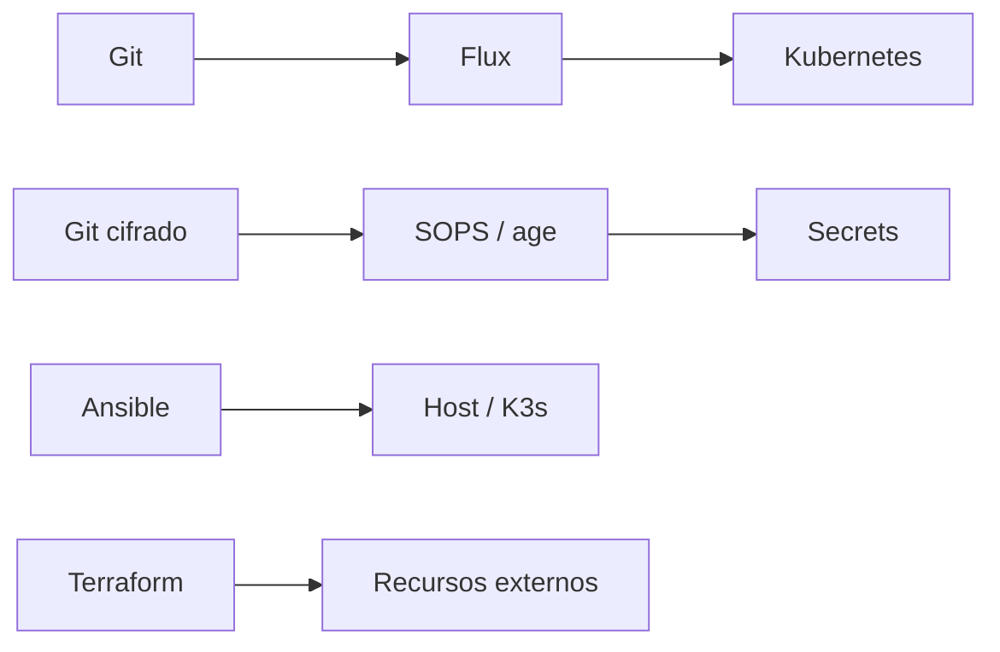

# GitOps, secrets e infraestructura reproducible

Después de añadir aplicaciones y observabilidad a mi clúster K3s, una pregunta empezó a incomodarme: **¿cuánto de este entorno existe porque está declarado y cuánto existe solamente porque recuerdo los comandos que ejecuté?**

La siguiente etapa consistió en reducir las decisiones que existían únicamente en el estado actual de la máquina.

## Tres capas, tres responsabilidades



Las herramientas pueden solaparse en capacidad sin solaparse en ownership. Para mí, una infraestructura reproducible empieza cuando está claro **quién es responsable de cada estado**.

## ¿Por qué Flux?

Elegí Flux porque el repositorio ya contenía manifests Kubernetes y Helm, y ya había adoptado SOPS + age para secrets. La decriptación SOPS nativa de `kustomize-controller` y el modelo pull-based encajaban bien con el laboratorio.

## Empezar por el workload menos peligroso

El primer workload bajo ownership de Flux fue `cloudflared`: pequeño, stateless, declarativo y con rollback sencillo.



Después validé drift manual, cambio versionado, rollback por Git y eliminación deliberada de un Secret seguida de su reconstrucción desde el repositorio cifrado. GitOps sin una prueba de reconstrucción puede ser solamente sincronización optimista.

## Secrets en Git, pero no en plaintext



El recipient público puede estar en el repositorio; la identidad privada no. Esto produce una consecuencia importante para DR: **Git por sí solo no reconstruye el clúster.** La identidad privada necesita una ruta independiente de recuperación.

## Self-healing necesita ser observado

Después de `cloudflared`, Firecrawl pasó a Flux. Introduje drift positivo escalando manualmente la API de una a dos réplicas.



El endpoint siguió disponible mientras Flux restauraba el estado declarado.

## Adoptar recursos existentes sin recrearlos

Prometheus, Grafana, Loki, Tempo, Alloy y OpenTelemetry Collector ya existían antes de Flux. Los HelmReleases se declararon para coincidir con los releases existentes, inicialmente suspendidos, y se activaron en orden conservador:



En cada etapa validé HelmRelease Ready, releases runtime, Pods, PVCs y los flujos funcionales de métricas, logs y traces. La adopción de GitOps fue una migración de ownership, no un redeploy ciego.

## GitOps no sustituye rollback

Si una reconciliación causa un problema, puedo suspender solamente la Kustomization o HelmRelease afectada, corregir Git y reanudar la reconciliación. La automatización es útil cuando también existe un camino claro para interrumpirla.

## Idempotencia como evidencia

Al reorganizar Ansible para separar variables comunes, producción y DR, el dry-run de producción terminó con:

```text
ok=16
changed=0
failed=0
```

Mientras tanto, el inventario DR deja backup consistente, R2 y `cloudflared` en `false` por defecto. No es solamente organización de YAML; reduce el blast radius.

## ¿Qué puede reconstruir Git?



Pero seguía faltando responder la pregunta principal: **si el servidor desaparece, ¿puedo realmente restaurarlo todo en otra máquina?**

Tener backups y poder hacer Disaster Recovery son cosas diferentes. Lo aprendí ejecutando el restore de verdad.

---

Proyecto: `guionardo/guiosoft-k3s-lab`.
