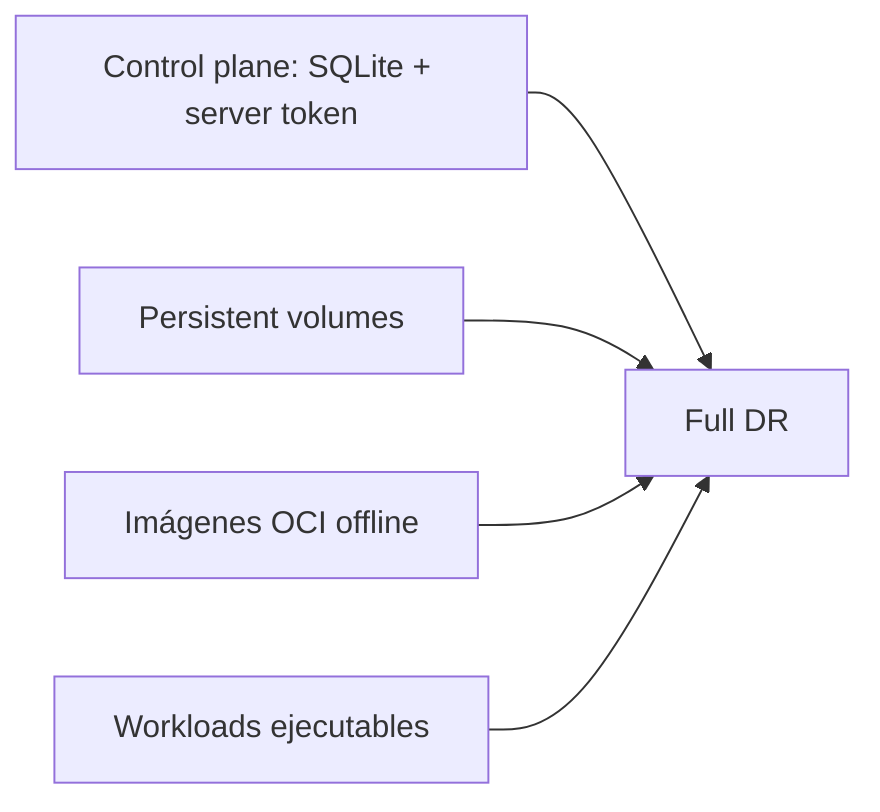
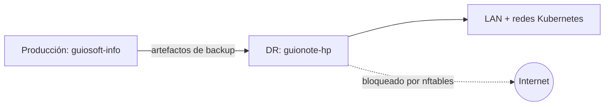
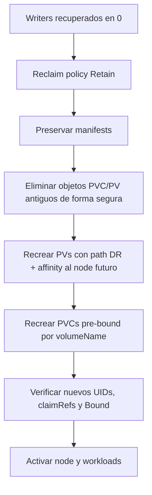
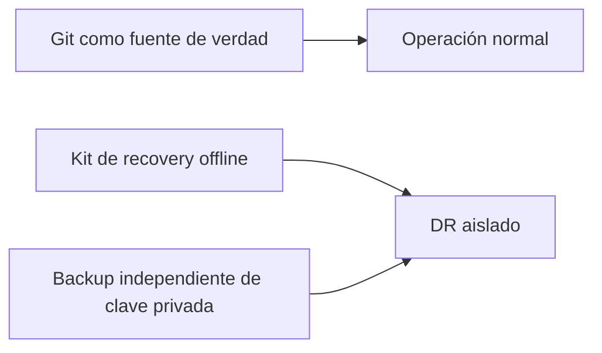

# Backup no significa Disaster Recovery

Tenía backups de mi clúster Kubernetes. Entonces hice la pregunta que suele ser fácil posponer: **¿puedo restaurarlos de verdad?**

La respuesta corta fue: no tan fácilmente como parecía. El ejercicio dejó de tratar sobre crear backups y pasó a tratar sobre producir un sistema ejecutable en otra máquina.

## Dos niveles de recuperación



Un backup del clúster no es una sola cosa.

## El target DR debe ser peligroso por diseño y seguro por control

Usé una segunda máquina Debian 13, `guionote-hp`, como target de recuperación mientras producción seguía funcionando en `guiosoft-info`.



El target recibe una barrera WAN independiente con nftables antes del restore. Los scripts destructivos exigen un marker DR, rechazan hostname/IP de producción y requieren confirmación explícita. El reset también ganó un preflight no destructivo; al probarlo deliberadamente contra producción, rechazó la ejecución antes de cualquier cambio.

## Primer problema: el datastore no vive solo

Restaurar únicamente base de datos y token manteniendo material TLS/credentials del target limpio podía producir incompatibilidades de bootstrap. La estrategia cambió: preservar el material del target en una zona segura, restaurar el datastore y permitir que K3s reconstruya el bootstrap desde el estado recuperado.

## Segundo problema: los PersistentVolumes locales recuerdan el servidor anterior

Los PVs recuperados seguían teniendo node affinity para producción y paths locales del storage de producción. Esos campos no pueden corregirse simplemente con un patch normal.



Pods recuperados en `Terminating` también podían mantener referencias a PVCs protegidos, así que solo se eliminaron los Pods que bloqueaban la transacción.

## Tercer problema: el clúster restaurado empieza sin el node DR

Durante el restore aislado, K3s arranca agentless (`disable-agent:true`). El Node DR todavía no existe. Por eso el remapeo de PV debe aceptar affinity para un **hostname futuro**.

## Cuarto problema: una imagen listada no es necesariamente un backup

El content store de containerd en producción no era un backup de imágenes fiable. La solución fue un kit OCI `linux/amd64` con checksums generados en origen, cargado mediante el directorio nativo de preload de K3s:

```text
/var/lib/rancher/k3s/agent/images/
```

La validación se realiza por CRI, manteniendo el recovery independiente de registries externos.

## GitHub también desaparece durante el desastre

Si DR bloquea Internet, el runbook no puede depender de `git pull`.



El kit lleva scripts, checksums, imágenes OCI y material cifrado. Las credenciales privadas siguen fuera de Git y tienen recuperación independiente.

## ¿Y los workloads?

Grafana, Loki, Prometheus y Tempo fueron recuperados. En un rehearsal, Tempo descartó un bloque WAL incompleto sin `meta.json`, una señal de que una copia de filesystem puede ser recuperable sin ser consistente a nivel de aplicación.

## El principal aprendizaje

| Suposición | Lo que mostró el rehearsal |
|---|---|
| Backup del datastore | No equivale a un clúster ejecutable |
| Datos del PV | No son automáticamente utilizables en otro node |
| Imagen en containerd | No es necesariamente un backup OCI fiable |
| Git disponible hoy | No garantiza Git durante DR |
| Script terminó con 0 | No prueba la postcondición |

Backup es un artefacto. Disaster Recovery es una capacidad que debe ejercitarse.

Después de conseguir recuperar el entorno apareció la siguiente pregunta: **¿cuánto tiempo tarda?** Ese es el tema del próximo artículo.

---

Proyecto: `guionardo/guiosoft-k3s-lab`.
