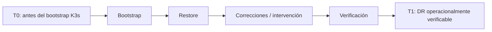
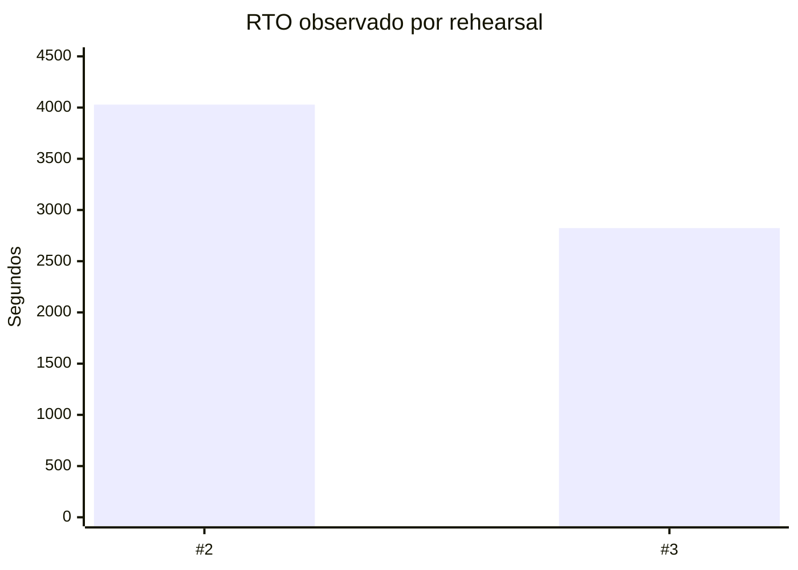
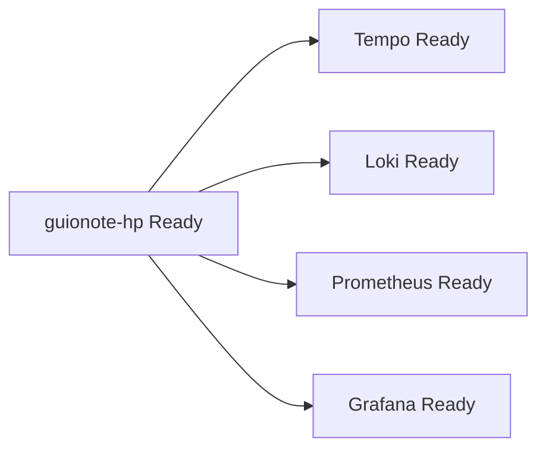

# Midiendo Disaster Recovery: reduciendo el RTO un 29,9%

Después de restaurar con éxito mi clúster K3s en una segunda máquina, podría haber terminado diciendo “Disaster Recovery probado con éxito”. Pero esa frase esconde una pregunta importante: **¿cuánto tiempo tarda realmente la recuperación?**

Empecé a tratar los rehearsals no solamente como pruebas funcionales, sino como experimentos medibles.

## El cronómetro debe empezar antes de la parte cómoda

T0 se registra antes del bootstrap de K3s en el target DR. El RTO observado incluye bootstrap, scripts, esperas, intervención del operador y tiempo investigando problemas encontrados durante el proceso.



Eso empeora el número y mejora la información.

## Rehearsal #2

| Medición | Valor |
|---|---|
| T0 | `2026-09-16T02:11:56Z` |
| T1 | `2026-09-16T03:19:05Z` |
| RTO observado | `4029 s = 1h 07m 09s` |

En T1 los cuatro workloads persistentes estaban Ready, los PV/PVC estaban Bound a `guionote-hp`, Flux seguía suspendido, `cloudflared` estaba en cero réplicas y la barrera WAN continuaba activa.

## Automatizar lo que enseña el rehearsal

El segundo rehearsal expuso pasos manuales y suposiciones frágiles. Se convirtieron en preflight por etapas, neutralización idempotente, assertions del estado restaurado, remapeo seguro de PVs, preload OCI, activación controlada, checkpoints, reporting automático y un kit offline autocontenido.

Una regla se repitió: **que un comando termine correctamente no demuestra que su postcondición se haya alcanzado.**

## Rehearsal #3



| Medición | Rehearsal #2 | Rehearsal #3 |
|---|---:|---:|
| RTO | `1h07m09s` | `47m03s` |
| Segundos | 4029 | 2823 |
| Delta |  | `-1206 s` |
| Mejora |  | `~29,9%` |

No eliminé del cronómetro el tiempo de debugging para obtener un número más bonito. Aun así, el RTO observado cayó aproximadamente veinte minutos.

## ¿Qué estaba saludable al final?



Los cuatro pares PV/PVC estaban Bound con paths DR y affinity a `guionote-hp`. Nueve imágenes OCI estaban instaladas mediante preload nativo de K3s. Flux seguía suspendido, `cloudflared` en cero réplicas, el aislamiento WAN activo y producción operativa.

## Los bugs encontrados forman parte del resultado

Tres hallazgos se volvieron invariantes: la neutralización debe verificar postcondiciones; el remapeo PV debe aceptar el node DR futuro; el reset debe eliminar checkpoints antiguos. El reset fue reforzado además con guards de paths destructivos y `PREFLIGHT_ONLY`.

## RPO tampoco es un único número

Los backups de control plane y PV se habían capturado en momentos diferentes. Decir “el RPO es X” ocultaba esa diferencia. Empecé a registrar el timestamp real de cada snapshot, lo que llevó posteriormente a crear un par formal control-plane + PV mientras los writers persistentes permanecen quiesced.

## ¿Por qué medir?

Sin medición podría escribir “restore automatizado y documentado”. Con medición puedo decir:

```text
RTO observado #2 = 1h07m09s
RTO observado #3 = 47m03s
mejora = ~29,9%
```

Y, más importante, puedo explicar **por qué** mejoró: descubrimientos operativos se convirtieron en automatización determinista.

La mayor incertidumbre restante era la consistencia entre los backups de control plane y PV. De ahí nació un recovery set con identidad propia y una ventana de consistencia medida en 64 segundos.

---

Proyecto: `guionardo/guiosoft-k3s-lab`.
