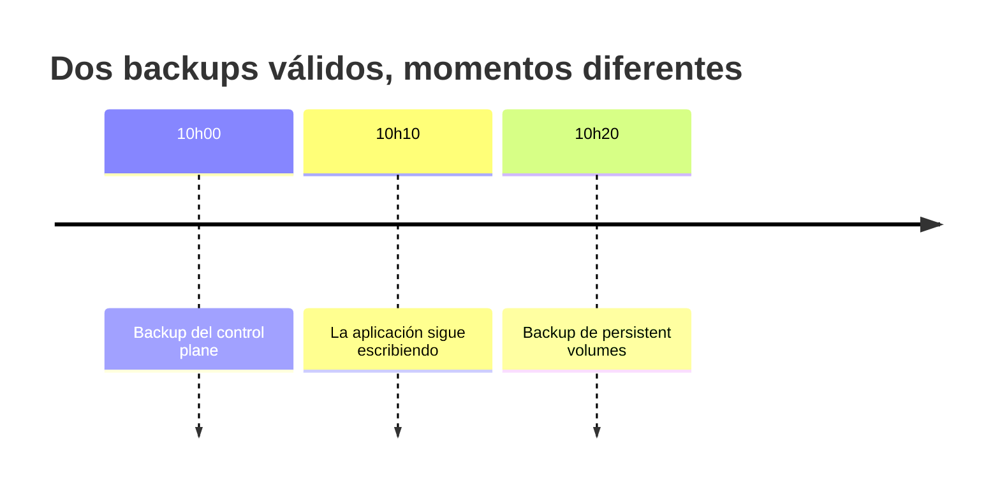
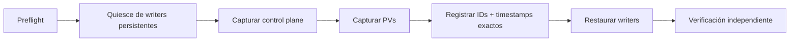
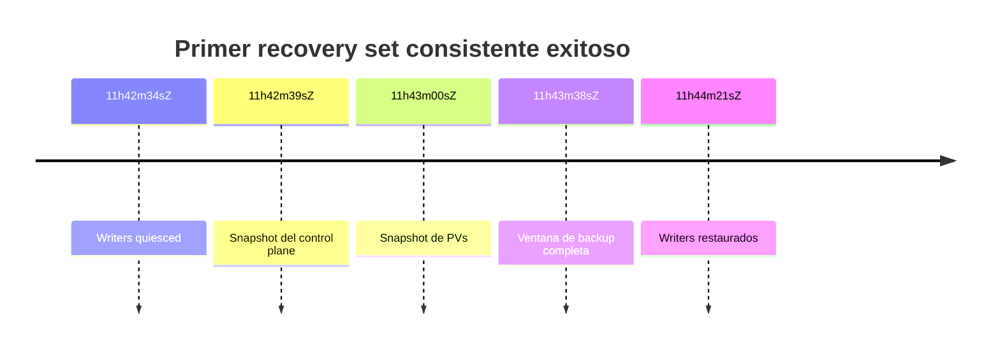
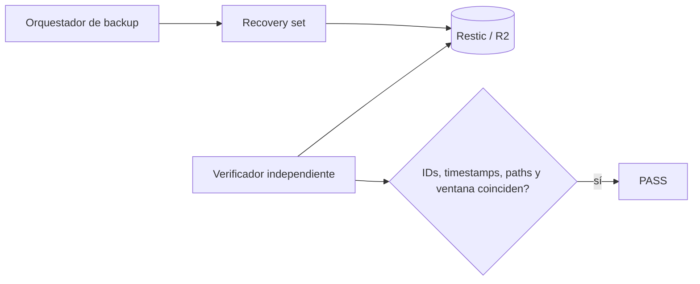
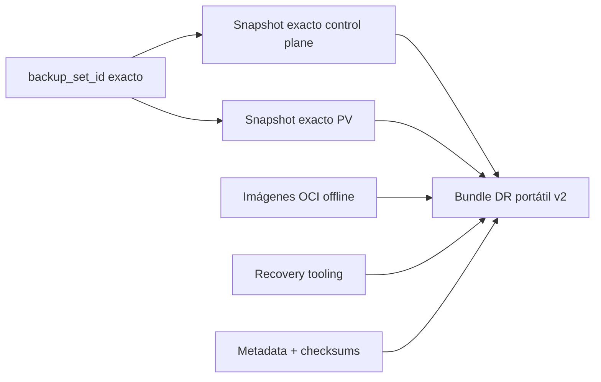

# El problema de los backups consistentes en Kubernetes

Después de tres rehearsals de Disaster Recovery ya podía reconstruir el control plane, restaurar PersistentVolumes, cargar imágenes OCI sin Internet y arrancar workloads en otra máquina. Pero quedaba un problema conceptual.

Tenía un backup del control plane y otro de los volúmenes. **Eso no significaba que tuviera un estado consistente del sistema.**

## Dos backups correctos pueden producir un restore incorrecto

Ambos backups pueden ser técnicamente válidos y representar instantes diferentes. En mi laboratorio esto se hizo tangible cuando Tempo tuvo que manejar un bloque WAL incompleto durante un restore anterior.

## La idea: bounded-consistency recovery set

No estoy afirmando atomicidad distribuida. Estoy afirmando que conozco y puedo medir el intervalo durante el cual los writers permanecen quiesced mientras se capturan ambos lados del backup.

## Quiesce sin luchar contra operadores

Grafana, Tempo y Loki son StatefulSets que pueden reducirse de forma controlada. Prometheus está gestionado por Prometheus Operator, así que cambio temporalmente `spec.replicas` del recurso Prometheus en lugar de luchar contra el StatefulSet generado.

El proceso es fail-closed: no hago force-delete de Pods writers de producción para conseguir un backup. Si el quiesce gracioso no termina dentro del límite, el backup consistente falla.

## Fallar antes de interrumpir writers

El orquestador valida la API K3s, herramientas y el repositorio Restic/R2 antes del quiesce. Retención, prune e integridad se ejecutan después de restaurar los writers. La ventana crítica contiene únicamente el trabajo que realmente necesita consistencia.

## Identidad exacta de los artefactos

El recovery set abandona “restaurar el backup más reciente” y registra IDs y timestamps exactos.

| Campo | Valor |
|---|---|
| `backup_set_id` | `20260916T114220Z` |
| Snapshot control plane | `6709a967...f3882` |
| Snapshot PV | `1830fedf...190e` |
| Ventana de consistencia | **64 segundos** |
| Resultado | `PASS` |

## Verificar el verificador

Que el orquestador diga `PASS` tampoco es evidencia suficiente. Un verificador independiente reabre el repositorio off-host y comprueba metadata, ambos snapshot IDs exactos, timestamps reales, el archive de control plane registrado, el root esperado de PVs y que los timestamps estén dentro de la ventana.

## La concurrencia de backups también es estado

Los workflows diario y semanal comparten `/run/lock/guiosoft-k3s-backup.lock`. El wrapper semanal mantiene el lock durante captura, verificación y mantenimiento Restic posterior, evitando que otro proceso cambie el contexto del repositorio durante la verificación.

## Del recovery set a un bundle portátil

El primer bundle v2 se construyó a partir del recovery set de 64 segundos y pasó su verificación completa.

## Qué cambió en mi definición de backup

Al principio backup significaba aproximadamente “el archivo existe fuera del servidor”. Después de los rehearsals significa que artefacto y checksum existen, snapshot y timestamp exactos son conocidos, la relación CP/PV está registrada, el restore fue ejercitado, imágenes y tooling están disponibles offline, los secrets tienen recuperación independiente y las postcondiciones se verifican.

Es más trabajo, pero transforma backup de una esperanza en una propiedad comprobable del sistema.

## Dónde está el proyecto ahora

El homelab combina infraestructura del host declarada con Ansible, recursos externos con Terraform, workloads reconciliados por Flux, secrets cifrados con SOPS + age, métricas/logs/traces correlacionados, backup off-host con Restic/R2, rehearsals completos de DR, recovery OCI offline, RTO medido, recovery sets acotados, bundle DR portátil ligado a snapshots exactos, guards fail-closed y separación declarativa entre producción y DR.

La parte más interesante del laboratorio ya no es Kubernetes en sí. Es usar un entorno pequeño para ejercitar preguntas que también aparecen en sistemas mucho mayores: **¿el estado está declarado? ¿es observable? ¿es recuperable? ¿podemos demostrarlo?**

---

Proyecto: `guionardo/guiosoft-k3s-lab`.
