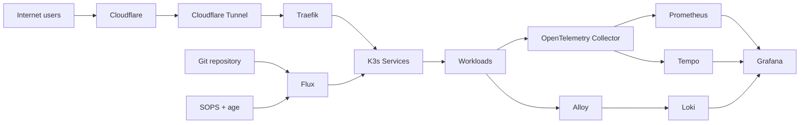
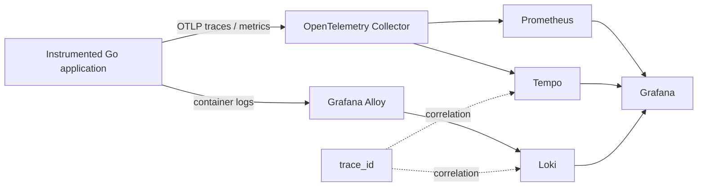
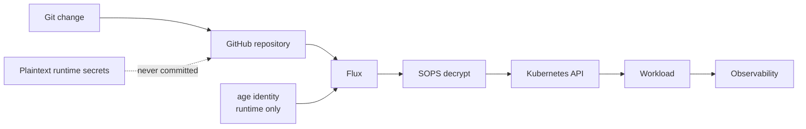
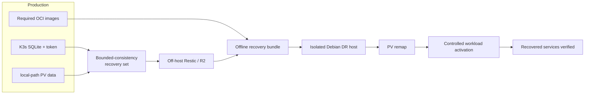
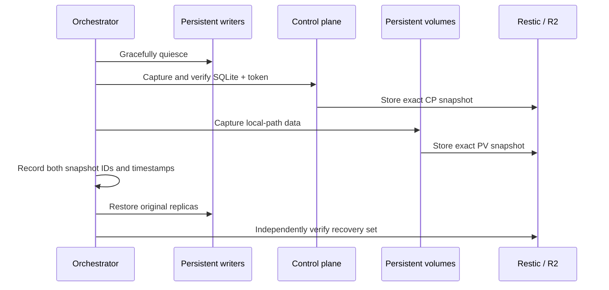

# Project showcase

This page is the visual entry point to the infrastructure implemented and validated in this repository. It intentionally separates **demonstrated evidence** from architecture plans and operational documentation.

## Platform at a glance



The production platform is a Debian 13 single-node K3s cluster. Public traffic reaches Kubernetes through Cloudflare Tunnel and Traefik. Flux owns the in-cluster declarative state, with SOPS + age for encrypted Kubernetes secrets. Firecrawl is deliberately LAN-only.

## What was actually validated

| Capability | Evidence from the project |
|---|---|
| Kubernetes platform | K3s production node operational with Traefik, CoreDNS, metrics-server and local-path storage |
| GitOps | Flux reconciles cloudflared, Firecrawl and the observability stack |
| Secret recovery | A deleted runtime Cloudflare Tunnel Secret was recreated from encrypted Git state through Flux + SOPS/age |
| Observability | Prometheus, Grafana, Loki, Tempo, Alloy and OpenTelemetry Collector validated end to end |
| Trace/log correlation | A real application trace ID was located in both Tempo and Loki |
| Full disaster recovery | Production state reconstructed on a separate Debian 13 physical host while production remained online |
| Offline recovery | OCI images and recovery tooling packaged and exercised without depending on GitHub during isolated recovery |
| Measured RTO | Rehearsal #2: 1h07m09s; rehearsal #3: **47m03s**, a **29.9%** reduction |
| Consistent recovery set | Exact control-plane and PV snapshots captured inside a measured **64-second** bounded-consistency window |
| Portable DR artifact | Verified offline bundle bound to the exact control-plane and PV recovery-set identities |

These are not target-state claims. They are outcomes recorded by the operational documentation and rehearsals in this repository.

## Observability path



The lab includes an instrumented Go application and a downstream service. Distributed W3C trace propagation, custom Prometheus metrics, Loki log ingestion and log-to-trace correlation were exercised against the running stack.

See [Observability](observability.md) and [OTel Go demo](otel-go-demo.md).

## GitOps and secrets



The private age identity remains outside Git. Encrypted SOPS manifests can be versioned, while Flux decrypts them only inside the cluster. Self-healing was tested rather than only configured.

See [GitOps](gitops.md) and [Secrets](secrets.md).

## Disaster recovery model



The recovery procedure is intentionally fail-closed. The DR target is marked explicitly, protected by an independent nftables WAN barrier, and checked against production hostname/IP guards before destructive operations.

Three full rehearsals drove changes to the recovery tooling. The second measured **4029 seconds (1h07m09s)**. The third measured **2823 seconds (47m03s)** while still counting bootstrap, troubleshooting and operator intervention.

See [Disaster recovery](disaster-recovery.md).

## Consistent backup model



The first independently verified recovery set used a **64-second bounded-consistency window**. Recovery selects the recorded pair of snapshots rather than independently choosing whichever control-plane and PV backups happen to be newest.

See [Backup](backup.md), [R2/Restic](r2-restic.md) and [Disaster recovery](disaster-recovery.md).

## Real screenshots

The diagrams above describe the validated architecture, but screenshots should remain evidence rather than decoration. The repository is prepared to host sanitized captures under:

```text
docs/showcase/screenshots/
├── grafana-overview.png
├── grafana-otel-demo.png
├── tempo-trace.png
├── loki-trace-correlation.png
├── flux-status.png
└── dr-rehearsal.png
```

Only real captures from the running environment or a rehearsal should be added. Before committing, remove or mask tokens, credentials, private URLs, user data and any identifiers that should not be public.

Once present, they can be embedded here and reused by the article series.

## Explore the implementation

| Area | Start here |
|---|---|
| Architecture | [docs/architecture.md](architecture.md) |
| Current state | [docs/current-state.md](current-state.md) |
| GitOps | [docs/gitops.md](gitops.md) |
| Observability | [docs/observability.md](observability.md) |
| Backup | [docs/backup.md](backup.md) |
| Disaster recovery | [docs/disaster-recovery.md](disaster-recovery.md) |
| Security / secrets | [docs/secrets.md](secrets.md) |
| Networking | [docs/networking.md](networking.md) |
| Storage | [docs/storage.md](storage.md) |
| Article series | [docs/articles/README.md](articles/README.md) |

The operational scripts under `scripts/`, Ansible roles under `ansible/`, Terraform under `terraform/`, and Flux/Kubernetes manifests in the repository are the implementation behind these diagrams and results.
